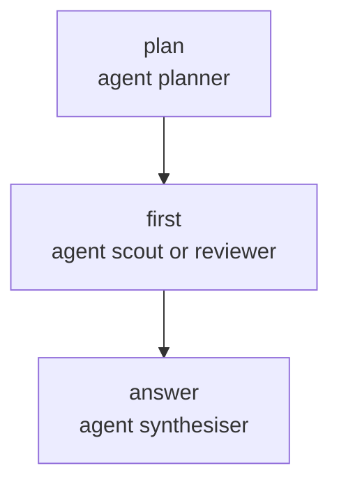

# Flows

```{note}
In pi, `/run` runs flows and `/flows` lists and plans them; `/step` takes a
flow as a stage, and the `subagent` tool runs one by name.
[From pipelines to flows](from-pipelines.md) rewrites a pipeline as a flow.
```

A flow is a task graph you write in YAML and Markdown, next to your agents. It is
built from a closed set of nodes, checked whole before its first spawn, and
walked by our code. No agent reads the file to decide what runs next: a model
produces values, and the runner reads them.

```markdown
---
name: split
description: A planner splits a question, one agent takes it, another answers
input: string
nodes:
  - id: plan
    agent: planner
    reads: [input]
    output: { first: scout | reviewer, task: string }
  - id: first
    agent-from: plan.output.first
    among: [scout, reviewer]
    reads: [plan.output.task]
  - id: answer
    agent: synthesiser
    reads: [input, first]
---

## plan
Split the request below.

## first
Do the task below.

## answer
Answer the request from the report below.
```

## The file

The frontmatter holds the structure, the body holds the prose.

| Key | Required | Meaning |
| --- | --- | --- |
| `name` | yes | the flow's name, the same as its file name without `.md` |
| `description` | yes | one line |
| `input` | yes | `string`, or a [schema](#schemas) for a typed input |
| `model` | no | the model of every agent turn, and of the flows it calls that set none, unless a command says otherwise |
| `timeout` | no | the default bound of one agent turn, here and in the flows it calls that set none: `90s`, `10m`, `1h` |
| `nodes` | yes | the root sequence |

A flow is a sequence of nodes, run one after the other. No node names a
successor, so a jump or a dangling edge cannot be written.

The body holds one `## <id>` section per `agent` node and nothing else. `###`
headings inside a section are prose, and so is a `##` inside a fenced code
block. Text before the first section is refused: no turn would read it.
`description:` and YAML comments are where a flow is documented.

## Where flows live

A flow is one `.md` file, found by its file name where agents are found:

1. `flows/` in the package, when the shipped ones are asked for;
2. `~/.pi/agent/flows/`, yours;
3. `.pi/flows/` in the repository, found by walking up from the working
   directory, and read only with scope `"project"` or `"both"`.

When two places hold the same name, the later one in this list wins, so your
own `build.md` replaces the shipped one. The agents a flow names come from the
same three places, under `agents/`, and so do the flows it calls.

A flow's agents are checked with the flow, before anything runs. A name that
matches an agent file which does not parse is reported as that file being
broken, with its path and the cause, rather than as unknown, and that file keeps
its name: a broken `.pi/agents/scout.md` is not replaced by your own `scout`. An
agent that declares `skills:` needs `read` in its `tools:`, and each skill has
to be found [where agents look for skills](agents.md#skills). These are the
refusals spawn would make, moved before the first turn.

The `pipelines/` directories the linear format used, `~/.pi/agent/pipelines/`
and `.pi/pipelines/`, are still read, and only so that each file there is
refused with `pipeline-format-removed`: nothing is loaded from them. A
`build.md` of your own left there would otherwise lose its name to the shipped
`build` flow without a word. [From pipelines to flows](from-pipelines.md) says
how to rewrite one.

In pi, `/flows` lists every flow found, with where it comes from, the most it
can cost in turns and time, and its description; a refused file is listed
beside the others with each fault under it, `file at: message`. `/flows <name>`
prints that flow's [plan](#bounds-and-renderings). Both run the flow stage
only, so a flow listed as valid can still be refused at launch. `/run <flow>
<input>` runs one, and `/run resume` carries one on: see
[Extension](extension.md#running-a-flow). A flow cannot be called `resume`.
`/step <flow> <instruction>` runs one as a stage of a chain walked by hand,
in the step's folder ([Walk a chain by hand](chain-by-hand.md)). The
`subagent` tool runs one when the model passes `flow` and `task`, its
questions put to you during the model's turn, and hands the model the run
directory ([Extension](extension.md#the-tool)).

## The shipped flows

Five flows ship in the package's `flows/`, each drawn in
[the reference](../reference/flows/index.md). They run the shipped agents and
name no model, so the model is yours to choose. A file of the same name in
`~/.pi/agent/flows/` or `.pi/flows/` replaces one, inside the flows that call
it too.

**`explore`** reads the code to answer a question. Three scouts run at once,
each on one task written in the file: where the thing is implemented, how it
is tested, what documents it. A synthesiser answers from the three reports. A
scout that fails reaches it as a failed report, which it says leaves a hole,
rather than failing the run.

**`split`** answers a read-only request the same way, with the tasks written
by a planner: one to four, each for a `scout` or a `reviewer`, run two at a
time, then one answer. A plan of more than four tasks fails the run before any
worker starts, since the list is never cut.

**`interview`** asks the person running it one question at a time, on a card
the interviewer writes in their language, then writes the specification from
the answers. The interviewer keeps the whole conversation (`memory: flow`). It
stops when it submits no question, when the person picks "That's enough", or
after six questions, which the loop reports as not converged while the
specification is still written. With nobody there, the first card gives
"enough", so the specification is written from the request alone.

**`build`** is unattended. A scout locates the code, a planner splits the
brief into subtasks, and each subtask goes to a pair, two at a time, each pair
in its own copy of the repository: a coder and a reviewer who remember each
other, for three rounds at most, the reviewer deciding through a verdict. A
pair that reaches three rounds still goes on, marked not converged. Once the
patches land, `.pi/checks/test.sh` runs and an auditor reads the whole change
against the brief. When the tests fail or the audit is not approved, what the
audit raised and nobody closed becomes the subtasks of a second round, and
there is no third. With nothing left open to hand round, the build gives up.
A build that gives up or ends its second round unapproved fails. One that
passes ends with a synthesiser's report, a few lines on what was done and what
is left, read from the diff, the last round's pairs and the audit. The check
is a script of your project: the run is refused before its first turn when
`.pi/checks/test.sh` is not there.

**`build-attended`** is `build` with somebody there. It calls `interview` on
the request, shows the specification and asks "Build this?". Answered yes, it
calls `build` on the specification, has the committer write the message from
the specification, the build's report and the diff, and commits on the run's own branch. Answered
no, the run ends `ok: true` with nothing built and nothing committed. With
nobody there, the confirm defaults to yes.

## Nodes

A node is `id:` plus exactly one kind key, which holds its main argument, and
that kind's options beside it. An id is letters, digits and `_`, unique in the
whole file, since addresses and conditions read it. It cannot be a word an
address uses (`input`, `item`, `diff`, `output`, `ok`, `error`, `previous`,
`carry`, `ledger`) or one CEL reserves (`in`, `loop`, `if`...).

A key ending in `-from` takes an [address](#reads-and-addresses) where its twin
takes a literal. Writing both on one node is refused, and so is any key the kind
does not have, a key valid on another kind included.

### `agent`

One turn of an agent from the catalogue.

| Key | Meaning |
| --- | --- |
| `agent` | the agent, by name |
| `agent-from` + `among` | an address naming an enum, and the agents it may pick, which are exactly its values |
| `reads` | the addresses handed to the turn, in order |
| `output` | a [schema](#schemas): the output is typed, instead of the agent's text |
| `memory` | an enclosing node's id, or `flow`: every node naming this agent and scope resumes the same subagent |
| `verdict` | an enclosing node with a `ledger:`: the turn answers with the `verdict` tool, and its output is `{ approved, remarks? }` |
| `retry` | how many more attempts after a failed one, default 0 |
| `timeout` | the bound of one attempt, `90s`, `10m`, `1h` |
| `on-fail` | `continue`: a failure stops at this node instead of ending the flow |

### `choice`

Ordered cases; the first whose condition holds runs, and `default:` runs when
none does. `default:` is always written, `[]` when nothing should run.

```yaml
- id: gate
  choice:
    - when: review.output.status == "approved"
      do: [ ... ]
  default: []
```

Its output is `{ case, output? }`: `case` is `"1"` for the first case, and so
on, or `"default"`; `output` is the output of the last node of the case that
ran. It is typed only when every case that runs a node ends on the same type,
and optional when some case runs none.

### `parallel`

Named branches, at least two, all started at once and joined when all end.

```yaml
- id: both
  parallel:
    tests: [ ... ]
    docs: [ ... ]
```

Its output is an object keyed by branch, each as its last node ended:
`both.output.tests.ok`, `both.output.docs.output`. A failed branch stays in it.

| Key | Meaning |
| --- | --- |
| `copies` | `true`: each branch works in its own copy of the repository |
| `fail-fast` | `true`: the first failed branch cuts the others |

### `map`

Its body, `do:`, once per item: `map:` takes a list of strings written in the
file, `map-from:` an address naming a list, with a required `max:`, the
longest list it takes. Inside the body, `item` is the current item; a nested
`map`'s `item` hides the outer one.

```yaml
- id: work
  map-from: plan.output.tasks
  max: 6
  concurrency: 2
  copies: true
  do:
    - id: act
      agent-from: item.worker
      among: [scout, reviewer]
      reads: [item.task]
```

Its output is a list in item order, each `{ item, ok, output?, error? }` as the
body's last node ended.

| Key | Meaning |
| --- | --- |
| `max` | with `map-from:`, the longest list taken; a longer one fails the `map` |
| `concurrency` | how many items run at once, default 1 |
| `copies` | `true`: each item works in its own copy of the repository |
| `fail-fast` | `true`: the first failed item cuts the others |
| `ledger` | its own id: each item keeps a ledger, read as `<map>.ledger` |

### `loop`

Its body, `do:`, again at the end of each iteration until its condition holds,
at most `max:` times. The condition is the main argument; it reads the body's
nodes as they ended in that iteration.

```yaml
- id: deliver
  loop: audit.output.approved
  max: 2
  ledger: deliver
  carry: { first: plan.output.subtasks, next: deliver.ledger }
  give-up: size(deliver.ledger) == 0
  do: [ ... ]
```

| Key | Meaning |
| --- | --- |
| `max` | required: the most iterations; reaching it fails the loop |
| `give-up` | a condition read when the main one is false; true ends the loop not converged |
| `carry` | `{ first, next }`: what `<loop>.carry` reads, `first` on the first iteration, `next` after each |
| `ledger` | its own id: the loop keeps a ledger across iterations, read as `<loop>.ledger` |

Inside the body, `<loop>.previous.<node>` is a body node as it ended one
iteration back, absent on the first. The type of `carry` is what both sides
share: the fields they have with the same name and type. The loop's output is
`{ converged, stop, iterations, last }`: `stop` is `until`, `give-up` or `cap`,
and `last` holds each body node as it ended in the last iteration.

### `check`

A script of the project, run with `bash`. It is the only form: the node
names a file, never a command, so one flow runs on projects that check
themselves differently.

```yaml
- id: tests
  check: .pi/checks/tests.sh
  timeout: 10m
```

| Key | Meaning |
| --- | --- |
| `check` | the script, by its path from the repository root |
| `timeout` | how long it may run, default `120s` |
| `on-fail` | `continue`: a failure stops at this node instead of ending the flow |

Its output is `{ passed, report }`. `passed` is whether the script exited 0,
and `report` is the last 8000 bytes of what it wrote, stdout and stderr mixed
in the order they came. A red check is a value: the node ran, and a condition
reads it (`loop: tests.output.passed`). The node fails only when the script
could not run: `unavailable` when `bash` cannot start, `timeout` when it runs
past its bound. `retry:` is refused: raise `timeout:`, or make the check
stable. A check has no `## <id>` section, since no model reads it.

Inside a `copies: true` block, a check runs in its branch's copy; anywhere
else, in the run's tree.

### `commit`

Everything in the working tree, committed by our code. The message is the
output of an earlier node, an ordinary `agent` node that reads what it needs:

```yaml
- id: message
  agent: committer
  reads: [input, diff]
- id: commit
  commit: message
```

| Key | Meaning |
| --- | --- |
| `commit` | the message: an earlier node's text, or a `string` field of its output |
| `on-fail` | `continue`: a failure stops at this node instead of ending the flow |

The run commits on a branch of its own, `combo/<slug of the input>`, created
from `HEAD` by its first `commit` and suffixed `-2`, `-3` when the name is
taken. Every later commit of the run goes on the same branch, and one that
finds `HEAD` elsewhere fails rather than committing there. Nothing is ever
pushed.

Its output is `{ committed, sha?, branch }`. A clean tree is a value,
`{ committed: false, branch }`. An empty message fails `empty-message` before
git is asked anything, and git refusing, a hook or a lock, fails `unavailable`
with git's own words. `retry:` is refused: the node writing the message can
take one. A commit inside a `copies: true` block is refused, since a commit in
a copy would break the patch that brings the branch home.

### `ask`

A question put to the person running the flow. What is written chooses the
form:

```yaml
- id: go
  ask: "Build this?"
  options: [Build it, Change the plan]
  enough: "Stop here"
  reads: [brief]
- id: sure
  ask: "Commit these changes?"
  confirm: true
  default: false
  reads: [diff]
- id: note
  ask: "Anything the reviewer should know?"
  timeout: 10m
  default: ""
```

| Written | Form | Output |
| --- | --- | --- |
| `options: [...]`, or `ask-from:` | a choice card | `{ answered, answer?, custom? }` |
| `confirm: true` | yes or no | `{ yes }` |
| neither | a free text | a `string`, `""` when left empty |

| Key | Meaning |
| --- | --- |
| `ask` | the question, as it is shown |
| `ask-from` | an address typed `Question`, whose options come with it |
| `options` | two to four labels, or `{ label, description? }`, no label twice |
| `confirm` | `true`: a yes or no |
| `enough` | on a choice card, the label of "that's enough", which gives `answered: false` |
| `default` | what nobody answering gives: a label of the options, `true` or `false`, or a text |
| `reads` | the addresses shown above the question, each under its name, a typed value as JSON |
| `timeout` | how long the card stays up, from when it is shown |
| `on-fail` | `continue`: a failure stops at this node instead of ending the flow |

The runner shows every text of the file exactly as written: the question, the
options, `enough:` and `default:`. A card in the person's language is an
`agent` node that outputs a `Question`, then an `ask-from:` reading it.

Literal options make `answer` an enum of their labels, and the card takes no
typed answer beside them, so `when: go.output.answer == "Build it"` is checked
against the labels before the run. After `ask-from:`, the labels are a model's,
in the person's language, so a condition may read `answered` and `custom` and
may not compare `answer` with a literal. To branch on what was picked there,
an `agent` node reads the answer and outputs an enum.

Not answering is a value where the file says what it is. `esc` on a card with
`enough:` is "that's enough". On any other card it is the run's stop key: the
whole run ends `stopped`, and `on-fail: continue` does not catch it. When
nobody is there to answer, or the card's `timeout:` fires, the node takes its
`default:`, else `answered: false` when it has `enough:`, else it fails with
`nobody` or `timeout`. Only a `timeout:` on the node bounds a card: the run's
`timeoutMs` and the flow's `timeout:` are for agent turns. `retry:` is
refused, and an `ask` has no `## <id>` section.

Questions asked at once, by branches running together, are shown one card at a
time in the order they came, each naming the visit that asks. Only the branch
asking waits for its card.

### `flow`

Another flow of the catalogue, run whole as one node:

```yaml
- id: spec
  flow: interview
  input: input
```

| Key | Meaning |
| --- | --- |
| `flow` | the flow called, by name |
| `input` | the address of what the callee reads as its `input` |
| `on-fail` | `continue`: a failure stops at this node instead of ending the flow |

The name is written in the file, never taken from a value. It is found where
the calling flow was found, and the nearest file wins, so a repository's
`interview.md` replaces the shipped one inside the shipped `build`. The callee
is checked whole with its caller. A callee that is refused refuses its caller
too, and the fault names the callee's file and its first fault. A call that
leads back to the flow making it, directly or through other files, is refused
with its path, even behind a `choice` that may never be taken.

`input:` is required, and it is an address, never a literal. Its type must be
the callee's `input:`, except that a callee taking `string` takes any value,
a typed one as JSON. The node's output is what the callee's last root node
outputs, typed when that node is. There is no `output:`, `model:` or
`timeout:` key. `retry:` is refused: running a flow again would ask answered
questions and commit again, so retries go on the callee's own agent nodes. A
`flow` node has no `## <id>` section.

Nothing of the caller reaches the callee but its `input`. The callee reads
only its own nodes, its `memory:` scopes are its own (`memory: flow` names the
callee's root, opened by each visit of the call and closed when it ends), and
it writes to no ledger of its caller. An agent named with `memory: flow` on
both sides is two subagents. The world is shared: the callee works in the
visit's tree, a branch's copy inside a `copies: true` block, and through the
run's ports, so its questions join the run's queue of cards and its commits go
on the run's branch. The rules about the world read through calls. A callee's
commit inside a `copies: true` block is refused, a callee that writes makes
the branches calling it at once need copies, and the run stage looks at every
check, question and read of `diff` a callee holds. Those faults are in the
caller's file, at the call path: `work/fix/commit.commit`.

A callee that fails ends the call with `child`, whose message names the visit
inside it: `spec/look: provider: ...`.

### Branches that run together

A `parallel` with several branches, or a `map` with `concurrency` above 1, runs
branches at the same time. As soon as one of them can write (an agent with
`write`, `edit`, `bash` or `subagent`), they need `copies: true`: a branch
reading a tree another one is changing reads a moving target. The rule is read
from the agents' files alone. A `commit` writes too, and since it cannot stand
in a copy, the way out is to commit after the block, or to run a `map` with
`concurrency: 1`.

With `copies: true`, each branch works in a copy of the tree as it stands,
uncommitted changes included, and the copies are removed when the block ends,
whatever ended it. Their patches then land in the run's tree one at a time, in
branch order, whatever order the branches ended in. Each branch's entry in the
block's output gains `landed`, whether everything it changed is in the tree,
and `refused`, git's reason, on the one whose patch did not apply: that stops
the landing, and the branches after it read `landed: false`. Nothing is
checked between patches; the `check` written after the block judges the tree.
A failed branch's patch lands like the others, and what landed stays when the
block fails: nothing is undone. A run that is stopped lands nothing, and each
branch's work stays committed on its copy's branch.

A `memory:` scope named inside a `copies: true` block must open inside it,
since a subagent works in one tree: `memory: flow` there is refused.

## Reads and addresses

A node reads, by address, the nodes that already ended before it in its own
sequence and in every enclosing one, `input` and `diff`. Nothing inside a
sibling block is visible: what leaves a block is the block's own output.
A bare id is that node's output, whole. A deeper address reads a node as it
ended:

| Address | What it is |
| --- | --- |
| `plan` | the node's output: its text, or its typed value |
| `plan.ok` | whether the node ran |
| `plan.output.first` | a field of a typed output |
| `plan.error.kind` | why the node failed, one of a closed set of twelve |
| `input` | what the run was given |
| `diff` | what the node's tree changed since `HEAD`, untracked files included |

An agent's text has no fields: it is read whole, never into. Every address is
checked before the first spawn.

`diff` is a text, computed when the node reading it starts, in its own tree:
`git diff HEAD` plus untracked files, cut at 60 000 bytes. It is the one
address whose value depends on when and where it is read. A node that reads it
fails `unavailable` when git cannot give it.

## Schemas

A typed output, or a typed input, is declared in a short notation that is YAML
read as a type:

| Written | Type |
| --- | --- |
| `string`, `number`, `boolean` | the scalar |
| `scout \| reviewer` | an enum: one of these strings |
| `[<schema>]` | a list |
| `{ task: string, note?: string }` | an object; `?` marks an optional field |
| `Question` | the question an `ask` card draws |

When a field needs a description for the model that fills it, write
`{ json-schema: ... }` with `type`, `properties`, `required`, `items`, `enum` and
`description`, and nothing else. A field name is letters, digits and `_`.

## Conditions

A condition is a strict subset of [CEL](https://cel.dev) syntax, so every
condition is also valid CEL. It has literals, addresses, `== != < <= > >=`,
`&& || !`, `in` on a list, `size()`, `has()`, and the `all` and `exists` macros.
It has no arithmetic, no ternary and no string functions: a node that decides
declares an enum.

A condition reads typed values only, and is type-checked before the first spawn.
A string compared with an enum must be one of its values, and the answer of an
`ask-from:` is compared with no literal. A condition that cannot
be evaluated (a failed node, an absent optional field) fails its node rather than
reading as `false`; guard it the CEL way, `audit.ok && audit.output.approved`.

## Running a flow

A run is launched in three steps, each refusing with faults rather than
starting:

```ts
const flow = checkFlow("build", loadFlowCatalogue({ cwd }));
if (!flow.ok) return flow.faults;
const run = await checkRun(flow.flow, { cwd, ports: { ask, check: bashCheck(), git: gitPort() }, somebodyThere: true });
if (!run.ok) return run.faults;
const result = await runFlow(run.run, "add a cache", { model, runDir });
```

`checkRun(checked, { cwd, ports, somebodyThere })` is the run stage: what the
flow stage cannot know, since it depends on the project. `cwd` is the working
tree, at the repository root. The flow is refused when it holds a `check` and
the launch gave no `check` port, or when a check's script is not there; and
when it holds a `commit`, a `copies: true` block or a read of `diff`, and the
launch gave no `git` port or `cwd` is not in a repository. With nobody there,
because `somebodyThere` is false or the launch gave no `ask` port, it is
refused when any `ask` with neither `default:` nor `enough:` could be reached,
behind a `choice` too, and each such `ask` is named. Each script is read
here, and what runs is what was read: an agent that edits the file during the
run changes nothing. What passes is a `CheckedRun`, holding the tree and the
ports it was checked against.

The `ask` port is an `AskUser`: it is handed the question and how to put it,
its form, the reads shown above it, the visit asking, the label of "enough" or
`false` when there is none, and a signal that takes the card down on a
timeout or a stop. It returns the answer, or `undefined` when the person
declined the card.

`bashCheck()` is the `check` port: it runs a script's content with `bash -c`
in a directory, `$0` being the script's path, and kills the script and every
process it started when it ends or runs past its bound. `gitPort()` is the
`git` port, and the only way the runner reaches git: the tree's diff, the
run's branch and its commits, the copies of a block and their landing. It has
no push, no reset and no rebase.

`runFlow(run, input, options)` takes the `CheckedRun` and the flow's input,
which must match its `input:`. Its options are `spawn`, `signal`, `onEvent`,
`model`, `timeoutMs` and `runDir`, and nothing of the world: that came with
the `CheckedRun`, so a flow checked against one project cannot run in
another. It returns `{ ok: true, output }`, the output of the last root node,
or `{ ok: false, error, path }`, the visit the failure started at. `parseDuration("10m")` reads a
duration the way a flow writes one, in milliseconds, for a `timeoutMs` typed
by a person: `/run --timeout` reads it so.

A visit is named by its path: the ids of the nodes around it, `#n` for a loop
iteration, `[i]` for a `map` item and the branch name for a `parallel`, all
numbered from 1: `deliver#2/work[1]/review#3/code`. A `flow` node is a
segment too, its callee's visits named under it: `spec/interview#3/ask_next`.

### The run directory

Given `runDir`, a run keeps its snapshot, its journal and its subagents'
transcripts there, and holds its lock while it runs. A `measuredRun` on the
same directory adds `usage.json` and the event stream ([Measuring a
run](#measuring-a-run)). Given none, nothing touches the disk, and the run
cannot be resumed.

- **The snapshot**, written before the first node runs: `snapshot.json` holds
  the flow file and every file it calls, each agent it names as it was read,
  each check script's content, the input, and the settings (`cwd`,
  `somebodyThere`, `model`, `timeoutMs`). Each skill a named agent declares
  is copied under `agents/<agent>/skills/<skill>/`, its whole directory
  included. This is exactly what validation read: `checkFlow` hands it on as
  the checked flow's `sources`, and `checkRun` as the run's `scripts`.
  `readSnapshot(runDir)` reads it back as `{ flow, catalogue, scripts, input,
  settings }`, and `checkFlow(flow, catalogue)` checks it again whatever the
  disk says by then. Read back, each agent lives in the run directory, so its
  skills resolve to the copies. A directory that already holds a snapshot is
  refused: one directory holds one run.
- **The journal**, `journal.jsonl`: one JSON line per fact, appended when it
  happens and never rewritten. `readJournal(runDir)` reads it back in order,
  ignoring a last line a crash cut short.
- **The transcripts**, one per subagent, under its home: its memory scope's
  path when it has one, its visit's path otherwise. Its files are
  `<home>/<agent>.jsonl` and `.html`, pi's own exports, written when it
  closes. A subagent keeping `memory: fix` serves every `fix#n/...` visit and
  leaves one `fix/coder.jsonl`, since a pi session is one replayable file; a
  visit with no scope leaves `fix#2/audit/reviewer.jsonl`; `memory: flow`
  leaves its file at the top. A name already taken, by an earlier life or by
  the subagent a timeout replaced, takes the first free `~n`: `coder~2.jsonl`.
  An agent whose `tools:` names `subagent` is handed the tool, its children
  drawn from the agents the flow names, and they go in `<parent>.children/`
  beside its files, named after their ids, theirs under them in turn:
  `split/lead.children/scout-3.jsonl`. The sessions behind the transcripts
  are kept in `.sessions/`.

| `type` | Written when | Holds |
| --- | --- | --- |
| `life_start` | a life of the run began, its first start or a resume, before anything else it wrote | `startedAt` |
| `visit_end` | a visit ended | the `visit_end` event itself, written before it is told |
| `carry` | a loop computed the `carry` of an iteration | `path` of that iteration (`fix#2`), `value` |
| `map_items` | a `map` starts | `path`, the `items` it runs over |
| `obligation_raised` | a verdict raised an obligation | `ledger`, the visit whose scope keeps it (a loop, or a `map` item), `visit`, the verdict visit that raised it, and the `obligation` |
| `obligation_closed` | a verdict closed one | `ledger`, `visit`, `id`, `closure` |
| `copy_opened` | a branch of a `copies: true` block got its copy | `path` of the branch, the copy's `dir`, git `branch` and `base`, the commit it started from |
| `copy_landed` | the block landed its patches | `path`, `landed`, `refused?` |
| `copy_lost` | a resume found a branch's copy gone, or its patch never landed | `path`, `why`: every fact under the branch written before it is forgotten |
| `branch_opened` | the first commit opened the run's branch | `branch` |
| `run_end` | the run ended | what `runFlow` returned |

The lock, `lock.json`, holds the pid and host of the process running the run.
It is made exclusively at the start and at each resume, and removed in a
`finally`. A stale lock is replaced while holding `lock.json.takeover`, made
exclusively as well, so when two resumes find the same stale lock only one of
them takes it.

### Measuring a run

The runner writes no measurement. A `measuredRun` subscribed to its events
and opened on its run directory writes `usage.json` there when it finishes,
and keeps the stream as `events.jsonl` with `record: true`:

```ts
const measured = measuredRun({ dir: runDir, record: true });
const result = await runFlow(run.run, "add a cache", { runDir, onEvent: measured.onEvent });
measured.finish();
```

A resume is measured the same way, and each of its lives adds its own
`events~n.jsonl`, and its own `main~n.jsonl` when it is given the parent
session. An experiment's cell is one already: its `runDir` is the cell's
directory, and its `onEvent` the cell's.

A flow run's `usage.json` holds what any run's does, and three lists more,
flat and linked by path and id, as `subagents` is linked by `parentId`:

- **`visits`**: one entry per visit, `{ path, node, kind, agent?, subagent?,
  life, ok, wallMs, usage }`, every kind included: a `check`, an `ask` or a
  `commit` has its time and no tokens. Each life's come in plan order, a
  visit before the visits it holds, branches running together as they
  ended. A visit that failed in one life and ran again in the next is listed
  twice, since it was paid twice.
- **`nodes`**: one entry per node address, its visit count and the sum of
  their `wallMs` and `usage`.
- **`lives`**: `{ startedAt, wallMs, usage, end, partial? }` per life, `end`
  being `ok`, `failed` or `interrupted`. `total` is their sum, its wall time
  summed without the gaps between them, and `parallelism` is over it. A life
  killed before it wrote its `usage.json` is rebuilt from the journal and
  marked `partial: true`: what its ended visits cost, and nothing of a turn
  cut mid-way or of its subagents. `lives` needs the journal, so a flow
  measured with no run directory has `visits` and `nodes` alone.

A `subagents` entry gains `home`, the folder of its transcript, `life` and
`visits`, the paths it ran.

### Resuming a run

```ts
const resumed = await resumeFlow("runs/2026-09-23T10-00-00", { ports, somebodyThere: true });
```

`resumeFlow(runDir, { ports, somebodyThere, timeoutMs?, spawn?, signal?,
onEvent? })` carries a run on from its run directory, as deep as its journal
goes:

- **It runs the snapshot.** The flow is checked again from `snapshot.json`,
  never from the files on disk, and the run stage takes the check scripts the
  run started with. When a flow file differs on disk, the result says so in
  `changed`, one line: "`flows/build.md` changed since the run started;
  resuming the version it started with". The new version is a new run.
- **Its settings are frozen.** The input and the model are the ones the run
  started with, and giving `model` or `input` refuses the resume. Only
  `timeoutMs` may be given again. `ports` and `somebodyThere` say where the
  resume runs, and the run stage holds the flow to them as it did at the start.
- **Every visit that ended survives.** It is not visited again: an answered
  `ask` is never asked twice. The first visit that did not end runs, inside
  an open loop or `map` if that is where the run stopped, with the loop's
  `carry` and `previous`, the ledgers and each `map`'s frozen list restored.
  Memory scopes open with fresh subagents, since no conversation is kept: each
  reads its `reads:`, its ledger and the tree. An `agent` visit cut mid-turn
  runs again whole, and what it half wrote stays on the tree.
- **A failed run replays its failure chain.** The visit it failed at and each
  node the failure travelled up through run again, with a fresh `retry:`
  budget, and so does a visit stopped or cut by `fail-fast`. A visit that
  failed under `on-fail: continue` stays: the flow read it as a value. When
  the flow itself decided the failure (a loop's cap or `give-up`, a condition
  that could not be read, a list past `max:`, a commit with no message),
  replaying it would decide the same, and the resume is refused.
- **It holds the run's branch.** When the run opened one, `HEAD` must be on
  it: a resume refuses with the `git switch` to type, and refuses a branch
  that is gone. It never switches on its own. Commits made by hand are
  accepted.
- **It takes its copies back.** A branch of a `copies: true` block whose copy
  the journal left open carries on in it while it is still there. A copy gone
  or moved, or one whose patch never landed, holds work the tree does not:
  the branch starts over in a fresh copy, its facts forgotten, and the
  journal says so with `copy_lost`.
- **It holds the lock.** A lock held by a live process on this host refuses
  with its pid; one whose process is gone is taken over; one from another host
  refuses with its path, to be removed by hand.

`latestResumable(runsDir, cwd)` finds the run to carry on when none is named:
the newest directory under `runsDir` whose snapshot was taken in `cwd` and
whose journal a resume would take, with the visit it picks up from, `{ ok:
true, runDir, from }`. When none would, it gives the newest run of `cwd` and
why it cannot, `{ ok: false, runDir, refused }`, and nothing when `cwd`
started no run there. `/run resume` stands on it.

The result is what `runFlow` returns, plus `from`, the visit it picked up at,
and `changed`; or `{ ok: false, refused }` with why, or `{ ok: false, faults }`
when the snapshot no longer passes a check. A directory holding no snapshot
throws: it holds no run. The same journal goes on, so its last `run_end` is how
the run ended, and the result's `usage` is what this resume spent.

`resumePoint(checked, journal)` is the reading underneath, shared with the dry
run: `{ ok: true, from }`, or `{ ok: false, refused }`. A journal naming a visit
the flow does not have was written by another flow, and is refused.

### What a turn is

Every `agent` visit is asked the whole turn, with or without `memory:`:

1. the node's section;
2. each address of `reads:`, in order, under `## <address>`. A text, or a
   value typed `string`, goes as it is; any other value goes in a ` ```json `
   block, and so does a node that failed, as `{ "ok": false, "error": ... }`.
   `<loop>.previous` on a first iteration gets no section;
3. for a node with `output:`, a line saying the `submit` call is the answer;
   for a `verdict:` node, the ledger's open obligations by id, and a line
   saying the `verdict` call is the decision and that an id left out stays open;
4. the line asking for an answer in the language of the work, last.

A node with `output:` answers only through `submit`, a tool built from its
schema and added to its agent's `tools:`. A call off the schema is refused
with the reason, and the model may call again; a turn that ends with no
accepted call fails the node with `schema`. Nothing is parsed out of prose.

### Blocks

A `parallel` starts every branch at once, and a `map` runs `concurrency` items
at a time over a list read once, when it starts. Both wait for every branch.
A branch that fails does not stop the others, and the block fails with
`child`, naming the first branch in order that failed. With `on-fail:
continue` on the block, it ends `ok: true` instead, and its output keeps each
failed branch as `{ ok: false, error }`.

With `fail-fast: true`, the first branch to fail cuts the ones in flight and
skips the ones not started. They end `cancelled`, which no `retry:` covers.

A `map-from` list longer than `max:` fails the `map` with `too-many` before
any item runs, naming the length and the bound.

A `loop` runs its body until its condition holds. After each iteration it
reads the condition, then `give-up:` when the condition is false, then its
cap. Giving up or reaching `max:` fails the loop with `unconverged`, and with
`on-fail: continue` it ends `ok: true` with `converged: false`. A body node
that fails ends the loop at once, before the condition is read. `carry.next`
is read only when the loop goes on, and `previous` starts over each time the
loop is entered. A condition or a carry that cannot be read fails the loop
with `condition`.

### Ledgers and verdicts

`ledger: <id>` opens a ledger: once for a loop, across its iterations, and
once per item for a `map`. A `verdict: <id>` node is given the `verdict` tool,
added to its agent's `tools:`, and writes to that ledger. The node is the only
thing that grants it, so a definition does not name it: the shipped `reviewer`
and `auditor` do not, and decide in prose everywhere else. Only the node that
raised an obligation may close it, one it does not mention stays open, and
nothing is rewritten. Its output is `{ approved, remarks? }`, where
`approved` is true only when it said yes and nothing is left open. A turn
that calls no `verdict` fails with `schema`. `<id>.ledger` reads the open
obligations as `[{ id, text }]` at the moment it is read.

### Failures, retries and timeouts

A node that fails stops its sequence, and the failure travels up: a block
failed by a node inside it fails with `child`, whose message names the visit
and its kind (`gate/look: provider: ...`). `stopped` and `cancelled` keep
their own kind on the way up. `on-fail: continue` on any node stops the travel
there, and later nodes read `x.ok` and `x.error`.

`retry: n` gives an `agent` node `n` more attempts after a `provider`,
`timeout` or `schema` failure, never after a stop or a cut. A retry asks the
same subagent again with the failure named, except after a timeout, which
starts a fresh subagent asked the whole turn, unless a `memory:` scope keeps
it. Every attempt's tokens count.

A turn's bound is the run's `timeoutMs`, else the node's `timeout:`, else the
`timeout:` of the flow the node is in, then of each flow calling it, outward,
else 30 minutes. A turn's model is the run's `model`, else the `model:` of
the flow the node is in, then of each flow calling it, else its agent's own. A check's bound is its own `timeout:`, else two
minutes: neither the run's `timeoutMs` nor the flow's `timeout:` reaches it.

`stopSwitch()` stops a run: pass its `signal` and `spawn`. `all()` ends the run
`stopped`: no node starts, and `on-fail: continue` does not catch it.
`one(id)` stops one subagent, and its visit fails `stopped` like any failure,
never retried.

### Memory and events

With `memory: <scope>`, every node naming the same agent and scope resumes one
subagent, closed when the scope ends: the run, for `flow`; the visit, for a
`choice` or a `loop`, all its iterations included; each branch of a
`parallel` and each item of a `map`, which never share one. Without it, each
visit has a fresh subagent, closed when the visit ends. A subagent takes one
visit at a time, so branches running together wait for each other on an outer
scope's. Nodes sharing a subagent declare the same `output:`, since its
`submit` tool is fixed when it is spawned.

The run reports `visit_start { path, node, kind }`, `node` being the address
through the calls (`spec/interview/ask_next`), and
`visit_end { path, node, kind, ok, output?, error?, case?, converged?, agent?, subagent?, model?, wallMs, usage }`
on the same stream as its subagents, and each subagent's `spawn` event
carries the `visit` it was spawned for and the `transcript` it will write.
`subagent` is the id an `agent` visit ran on. `usage` is the delta of pi's
counters over the visit, every attempt and nested visit included: a
delegate's turns are its own session's, not the visit's.

### A dry run

`dryRunFlow(checked, input, answers, options)` is the same run with every agent
turn, every check, every commit and every question answered by a script, and
nothing of the
world touched: it takes what `checkFlow` returned, reads no check script, runs
none, and never runs git. `diff` reads as an empty text, and a `copies: true`
block makes no copy, each of its branches reading as landed. It returns what
`runFlow` does plus `journal`, the entries a run would write, in order and in
an array, with zero tokens. A copy's entries have no `dir` or `branch`.

```ts
// The `split` flow at the top of this page, its `first` node given `retry: 1`.
const run = await dryRunFlow(split, "add a cache", {
	plan: { first: "scout", task: "find where results are stored" },
	first: [{ fail: "timeout" }, "in src/store.ts"],
	answer: "Put the cache in front of src/store.ts.",
});
```

A key is a node's address or an exact visit path, which wins. A value is one
answer, used for every attempt, or a list consumed attempt by attempt within
the enclosing path: each `map` item has its own list, and a loop's iterations
share one. A list is always a list of answers, so a list-typed output is
written inside one. An answer is an output, the `verdict` call of a
`verdict:` node (`{ approved, remarks?, resolved?, raised? }`), a check's
`{ passed, report }`, a commit's `{ committed, sha?, branch }`, an ask's
output, or a failure: `{ fail: "provider" | "timeout" | "schema" }` for an
agent turn, `{ fail: "unavailable" | "timeout" }` for a check,
`{ fail: "unavailable" }` for a commit. An ask takes `{ fail: "nobody" }`,
`{ fail: "timeout" }` when it has a `timeout:`, and `{ fail: "stopped" }`, the
card declined, when it has no `enough:`. The first two take the node's own
path, its `default:` or `enough:` included. A choice card answered with
`{ answered: false }` needs `enough:`, and one answered with
`{ answered: true }` names its `answer`. A commit's `empty-message` is not
scripted: an empty answer to the node that writes the message gives it.

A `flow` node is scripted whole by a key on it, whose answer is the callee's
output or `{ fail: "child" }`, and its callee is then not walked. Keys under
it walk into the callee instead, by address through the call
(`spec/round/look`) or by visit path (`spec/round#2/look`). A call with no key
of either kind is walked into. The script is checked before the start, and
refused with every fault in it:

| Code | What it means |
| --- | --- |
| `answer-unknown-node` | the key names no `agent`, `check`, `commit`, `ask` or `flow` node, or its path leads to none; the message offers the address meant |
| `answer-past-max` | a visit path's iteration or item is past its bound, or a list holds more answers than the node can be asked for |
| `answer-off-schema` | the answer does not match the node's `output:`, is not a text for a node with none, is not a check's `{ passed, report }` or a commit's `{ committed, sha?, branch }`, or is not an output of the ask's form |
| `answer-fail-kind` | `fail:` names a kind the node cannot fail with |
| `answer-flow-overlap` | a key answers a `flow` node whole and another walks into it, which would never be asked |

A visit the script does not answer stops the dry run with
`{ ok: false, unscripted: "<visit path>" }`, which no `on-fail: continue`
absorbs: a hole in the script is the test's mistake, not the flow's.

Given `from`, a journal, the dry run resumes it through `resumePoint`, as
`resumeFlow` resumes a run directory: the journal handed back starts with its
entries, and a journal a resume would refuse gives `{ ok: false, refused }`.
A visit that survives is not asked again, so a script that leaves its answer
out shows it was not:

```ts
// `plan` and `first` ended; the run was killed during `answer`.
const killed = run.journal.slice(0, 2);
const resumed = await dryRunFlow(split, "add a cache", { answer: "Put the cache in front of src/store.ts." }, { from: killed });
```

## Bounds and renderings

Every loop and every `map` has a bound written in the file, so a checked flow
knows its worst case before its first spawn. `checked.bounds` holds it:
`total`, and `nodes`, each node's worst case over every visit a run can make
of it, by its address through the calls (`spec/look` for `look` in the flow
the node `spec` calls). A bound is `{ turns, ms, waits }`. It is shown, never
judged: no flow is refused for what it could cost.

- An `agent` node asks for `1 + retry` turns per visit, each bounded by its
  `timeout:`, the nearest flow's around it, or 30 minutes.
- A `check` takes its `timeout:`, an `ask` its `timeout:` when it has one, and
  a `commit` nothing. An `ask` with no `timeout:` sets `waits`: it can wait
  for a person as long as they take.
- A sequence adds up. A `choice` takes the worst of its cases, whichever
  would run. A `parallel` adds its branches' turns and takes the longest
  branch's time. A `map` runs its body once per item, its literal list or its
  `max:`, in waves of `concurrency`. A `loop` runs its body `max:` times.
- A `flow` node counts its callee's nodes where the call stands, and a callee
  that sets no `timeout:` takes its caller's.

The time is what the flow waits for when every bounded wait runs to its bound,
and nothing else: spawning a subagent, git and landing copies are not counted.
It takes branches running together to run together, while two branches
resuming one subagent of an outer `memory:` scope, or asking at once, wait for
each other. A `timeoutMs` given at launch replaces every agent turn's bound,
which the checked flow cannot know.

`planOf(checked)` is the plan: one line per node, in the tree the file
writes, a `choice` case and a `parallel` branch being lines too. Each line has
its kind, its id, the visit path it stands for, with `#n` where a loop numbers
its iterations and `[i]` where a `map` numbers its items, what the check
resolved, and its bound. `showPlan(plan)` writes it as text, every line marked
`○`, a visit not made yet. The flow at the top of this page, `first` given
`retry: 1`:

```text
split · flows/split.md · input string · ≤ 4 turns · ≤ 2h
○ plan · agent planner (agents/planner.md) · reads input · output { first: scout | reviewer, task: string } · timeout 30m by default · ≤ 1 turn · ≤ 30m
○ first · agent from plan.output.first: scout (agents/scout.md), reviewer (agents/reviewer.md) · reads plan.output.task · retry 1 · timeout 30m by default · ≤ 2 turns · ≤ 1h
○ answer · agent synthesiser (agents/synthesiser.md) · reads input, first · timeout 30m by default · ≤ 1 turn · ≤ 30m
```

A turn's timeout says where it came from: nothing after it for the node's
own, `from the flow`, or `by default`. A call is one line, naming the callee
and the file it resolved to.

`mermaidOf(checked)` is the flow as a Mermaid `flowchart`, and only its
structure: a sequence is arrows, a `choice`, `parallel`, `map` or `loop` is a
subgraph, and every other node is one box with its id and kind. A case's
condition is on its arrow, a loop's `until` on its way back, every `max:` in
its block's title, and `on-fail: continue` in the box it applies to. `reads:`
are not drawn. A call is one box with the callee's name, its file and its
`input:`; the callee has its own diagram. The same flow:



`npm run docs` draws each flow the package ships into
[`docs/reference/flows/`](../reference/flows/index.md), and `npm test` fails
when a page there no longer matches its flow.

### The live view

`livePlan(checked, journal, events)` is the plan of a run, filled as its
visits go. `journal` is what the run's earlier lives wrote and `events` is
what this life reports on the stream. A finished run's journal alone draws
its last frame, a live run's events alone draw it as it goes, and a resume
passes both. A dry run reports the same events and hands back the same
journal, so its result is drawn the same way.

Each line is folded by the state of its visit:

- A visit running now is expanded. A loop shows every iteration it has run,
  and the current one is open. A `map` shows every item and a `parallel`
  every branch, since they run together, each folded to one line once it
  ended. A `parallel` line reads `1/2` until its join, and a `map` line
  counts its items the same way. A running call expands its callee's plan
  under it.
- A visit that ended is one line: why it failed, or the agent it ran, the
  case a `choice` took, a loop's iterations and whether it converged, the
  items or branches a block joined. Its time and tokens follow.
- A node not visited yet is its plan line, marked `○`. A `choice` folds its
  cases to one line until it decides (`○ case 1, default`), then shows the
  case it took and one line for the others (`○ not taken: default`).
- A node its sequence never reached, because a failure or a stop ended it,
  keeps its line, marked `–` and nothing more.
- An `ask` waiting for its answer is `blocked`, and a line an `agent` visit
  is running on names its subagents, from the `visit` their `spawn` carries.

`showLive(live, width)` writes it as text, the summary line first, each line
cut to `width`, a running visit naming its subagents. `showSummary(live,
width)` is the summary line alone. `liveRows(live)` is the lines under it,
uncut, for a caller that draws them its own way: each with its depth, its
state, its glyph, its text and the subagents of a visit running now. The
glyphs are the TUI's: `●` running, `✓` done, `✗` failed. The run of the loop
of two around a `map`, a `parallel`, a `choice` and a verdict in the tests,
as its second iteration starts its second item:

```text
● f · 10 visits · 0s · ↑0 ↓0
● deliver · #2 of 2
  ✓ deliver#1 · 0s · ↑0 ↓0
  ● deliver#2
    ● deliver#2/work · 1/2
      ✓ deliver#2/work[1] · 0s · ↑0 ↓0
      ● deliver#2/work[2]
        ● deliver#2/work[2]/code
    ○ deliver#2/both · parallel · ≤ 2 turns · ≤ 1h + a person's answer
      ○ deliver#2/both/left
        ○ deliver#2/both/left/look · agent scout (agents/scout.md) · timeout 30m by default · ≤ 2 turns · ≤ 1h
      ○ deliver#2/both/right
        ○ deliver#2/both/right/sure · ask "Go on?" · confirm · a person's answer
    ○ deliver#2/gate · choice of 1 case · ≤ 2 turns · ≤ 1h
      ○ case 1, default
    ○ deliver#2/audit · agent reviewer (agents/reviewer.md) · verdict to deliver · timeout 30m by default · ≤ 2 turns · ≤ 1h
○ after · agent synthesiser (agents/synthesiser.md) · timeout 30m by default · ≤ 1 turn · ≤ 30m
```

The summary counts every visit that ended, as it last ended, and every one
that failed, those `on-fail: continue` absorbed included. It names each loop
that hit its cap or gave up (`fix not converged`) and adds up what every
life cost. Past the first life it says how many there were, how many were
killed before writing their end (`2 lives (1 partial)`), and the visit the
last one picked up from (`resumed from fix#2/work`). A visit from an earlier
life is drawn like any ended visit. Each life opens with its `life_start`,
so the journal alone tells a killed life from the next one. A killed life's
cost is what its ended visits cost, and its time adds up branches that ran
together.

In pi, `/run`, a flow stage of `/step` and the `subagent` tool draw it above
the prompt, with what each subagent of a running visit is doing under it.
`/run` ends its answer with the last frame, and the tool its row. A
subagent's `spawn` carries its `home`, the path of its memory scope or of its
visit, and herdr names a flow's split by it: `coder @ deliver#2/work[1]/pair`.

## Faults

A flow that does not pass is refused with every fault at once, in file order,
each as `{ code, file, at, message }`. `at` is the node's id, or the flow's key,
then the offending key: `first.agent-from`. A fault that only exists where a
callee lands is in the caller's file, at the call path: `work/fix/commit.commit`. `checkFlow` and `checkRun` both
refuse this way; `check-script-missing`, `check-port-missing`,
`git-port-missing`, `not-a-repository` and `unattended-ask` are the run
stage's.

| Code | What it means | How to fix it |
| --- | --- | --- |
| `yaml-syntax` | the frontmatter is not valid YAML; the only fault returned | fix the YAML at the line given |
| `not-a-flow` | the file has no frontmatter mapping | start the file with `---` and the flow's keys |
| `pipeline-format-removed` | the file is in an old `pipelines/` directory, a linear pipeline nothing reads | rewrite it as a flow in `flows/` beside it, as [From pipelines to flows](from-pipelines.md) shows, then delete it |
| `name-mismatch` | `name:` differs from the file name | rename one of them |
| `reserved-name` | the file is `resume.md`, the word `/run resume` takes | rename the file |
| `unknown-flow` | no flow file has that name | use the name offered, or add the file |
| `broken-flow` | a `flow` node calls a flow that is refused; the message gives its file and first fault | fix the callee |
| `call-cycle` | a `flow` node calls a flow that leads back to this one, directly or through others; the message gives the path | break the cycle: a flow cannot call itself |
| `flow-input-mismatch` | a `flow` node's `input:` is not of the type its callee's `input:` declares | hand it a value of that type, or declare the callee's input `string` |
| `missing-key` | a required key is absent | add it |
| `unknown-key` | a key this flow or this kind of node does not have | use the key offered, or remove it |
| `key-type` | a key holds a value of the wrong type | write the type the message names |
| `node-kind` | a node has no kind key, or more than one | keep exactly one |
| `twin-keys` | a key and its `-from` twin on one node | keep the literal or the address |
| `invalid-id` | an id is not letters, digits and `_` | rename it, `ask-next` as `ask_next` |
| `reserved-id` | an id is a word an address or CEL uses | rename it |
| `duplicate-id` | two nodes of the file share an id | rename one |
| `unknown-agent` | no agent of the catalogue has that name | use the name offered, or add the agent |
| `broken-agent` | the agent file of that name is not an agent: its YAML, or a missing `name:` or `description:` | fix the file at the path given |
| `skills-without-read` | the agent declares `skills:` and its `tools:` leave out `read`, so it could not open one | add `read` to its `tools:`, or drop `skills:` |
| `unknown-skill` | a skill the agent declares is in none of the directories listed | fix the name, or add the skill |
| `skill-hidden` | a skill the agent declares sets `disable-model-invocation`, so pi never shows it | drop it from `skills:`, or unset the flag |
| `unknown-address` | an address names nothing readable here | read a node that already ended, or a field that exists |
| `invalid-address` | an address is not a name followed by fields, or reads into text | write `node.output.field`, and read an agent's text whole |
| `among-without-from` | `among:` beside `agent:` | use `agent-from:`, or drop `among:` |
| `among-mismatch` | `among:` does not name exactly the enum's values | make the two lists agree |
| `unknown-scope` | `memory:` names no enclosing node | name one, or `flow` |
| `memory-output-mismatch` | two nodes share a subagent through `memory:` and declare different `output:` schemas; the subagent's one `submit` tool takes one | declare the same schema, or give one node another scope |
| `carry-mismatch` | a loop's `carry:` sides share no field | make `first` and `next` agree on the fields carried |
| `verdict-with-output` | a `verdict:` node also declares `output:` | drop `output:`: the verdict is the output |
| `copies-needed` | branches that run together write without copies, a flow they call included | add `copies: true`, or run a `map` with `concurrency: 1`; a `commit` goes after the block |
| `retry-refused` | `retry:` on a node that is not retried: a `check`, a `commit`, an `ask` or a `flow` | raise a check's `timeout:` or make it stable; retry the node writing a commit's message; give an ask a `default:`; retry a callee's agent nodes |
| `check-script-missing` | a check's script is not in the working tree, or is not a file | add the script, or fix its path from the repository root |
| `check-port-missing` | the flow holds a `check` and the launch gave no `check` port | pass one, `bashCheck()` |
| `commit-in-copies` | a `commit` inside a `copies: true` block, a callee's included | commit, or call the flow, after the block |
| `memory-outside-copies` | a node inside a `copies: true` block names a `memory:` scope that opens outside it | name a scope inside the block, or none |
| `ask-form-conflict` | an `ask` holds keys its form does not take together: `options:` with `confirm:`, either with `ask-from:`, or `enough:` on a yes or no or a free text | keep the keys of one form |
| `ask-options-count` | literal `options:` offer fewer than two or more than four | offer two to four |
| `ask-options-duplicate` | literal `options:` offer a label twice | make each label its own |
| `ask-default-mismatch` | an ask's `default:` is not of its form: not one of its labels, not `true` or `false` on a yes or no, not a text | write a value its card could have given |
| `git-port-missing` | the flow holds a `commit`, a `copies: true` block or a read of `diff`, and the launch gave no `git` port | pass one, `gitPort()` |
| `not-a-repository` | the same, launched in a directory that is not in a git repository | launch it at the root of a repository |
| `unattended-ask` | nobody is there, or there is no `ask` port, and an `ask` with neither `default:` nor `enough:` could be reached | launch it with somebody there, or give the ask a `default:` |
| `section-missing` | an `agent` node has no `## <id>` section | write its section |
| `section-empty` | a section has no text | say what the turn is asked |
| `section-duplicate` | two sections share a heading | merge them |
| `section-unknown` | a section matches no node | rename it to the id offered, or remove it |
| `section-not-agent` | a section names a node that is not an `agent` node | remove it: only an agent turn reads prose |
| `body-preamble` | text before the first section | move it to `description:` or a YAML comment |
| `schema-invalid` | a schema is outside both notations | write it as the message says |
| `condition-syntax` | a condition is not in the language | rewrite the part quoted |
| `condition-unknown-address` | a condition names nothing readable | read what the message lists |
| `condition-type` | a condition's parts do not fit together, or it is not a boolean | compare values of one type |
| `condition-enum-value` | a string compared with an enum is not one of its values | use one of the values listed |
| `condition-free-string` | a literal compared with the answer of an `ask-from:`, which a model wrote in the person's language | read `answered` or `custom`, or have an agent node read the answer and output an enum |
