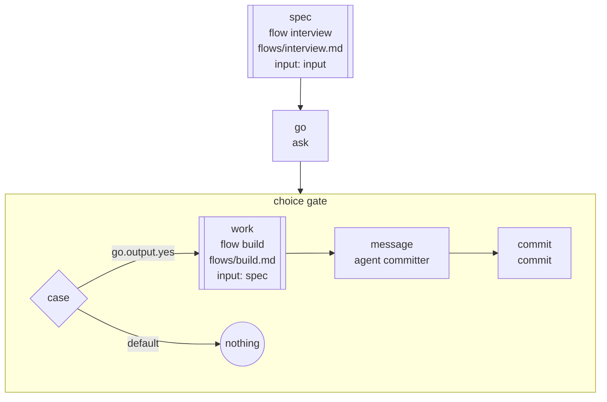

<!-- Generated by scripts/gen-docs.ts from flows/. Do not edit by hand. -->

# `build-attended`

Interview the user, confirm, build, then commit on the run's branch

Source: [`flows/build-attended.md`](https://github.com/AI-for-dev/combo/blob/main/flows/build-attended.md)

