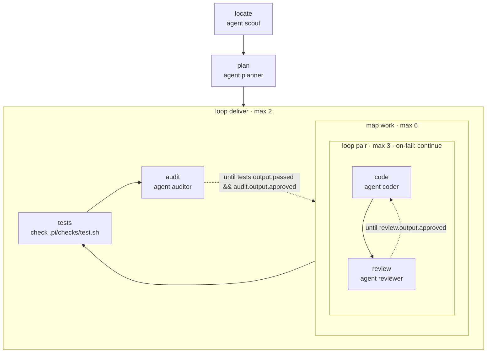

<!-- Generated by scripts/gen-docs.ts from flows/. Do not edit by hand. -->

# `build`

Locate the code, split the work, implement it in pairs, check and audit the whole

Source: [`flows/build.md`](https://github.com/AI-for-dev/combo/blob/main/flows/build.md)

