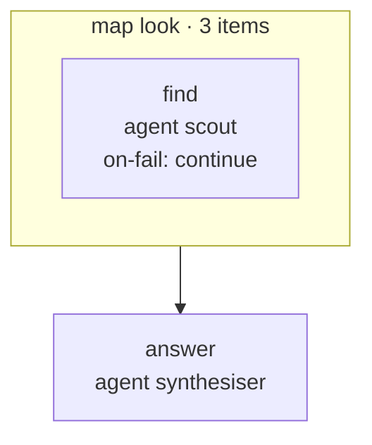

<!-- Generated by scripts/gen-docs.ts from flows/. Do not edit by hand. -->

# `explore`

Three scouts read the code in parallel, then one agent answers from what they found

Source: [`flows/explore.md`](https://github.com/AI-for-dev/combo/blob/main/flows/explore.md)

