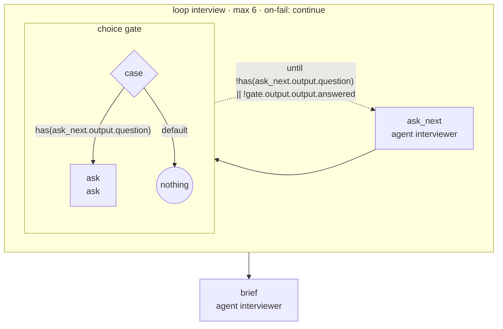

<!-- Generated by scripts/gen-docs.ts from flows/. Do not edit by hand. -->

# `interview`

Ask the user one question at a time, then write a specification

Source: [`flows/interview.md`](https://github.com/AI-for-dev/combo/blob/main/flows/interview.md)

