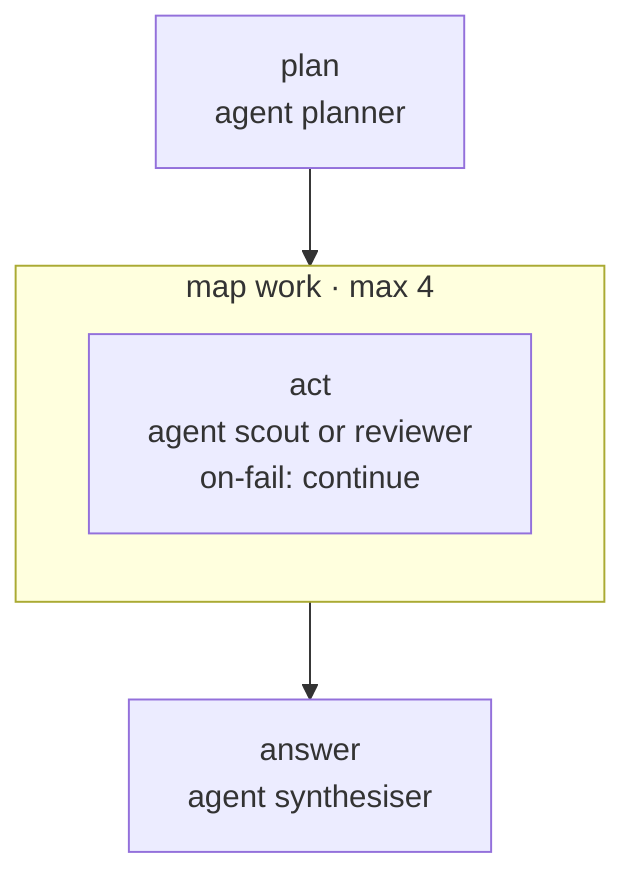

<!-- Generated by scripts/gen-docs.ts from flows/. Do not edit by hand. -->

# `split`

A planner splits a read-only question between a scout and a reviewer, then one agent answers

Source: [`flows/split.md`](https://github.com/AI-for-dev/combo/blob/main/flows/split.md)

