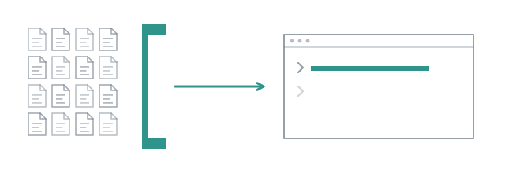

# A scout reads twenty files so you do not have to



Ask a coding agent where something lives in a repository it has never seen, and
watch the status line. It reads a file, then another, then greps, then reads
five more. Every one of those lands in your session's context and stays there
for the rest of the conversation. Ten questions later the window is half full
of files you never looked at, the model is slower, and it has started to lose
the thing you actually asked for.

A bigger window does not fix that. Somebody else's window does.

## Measure the problem first

Load the extension in this repository:

```bash
pi -e extension
```

The status line above the prompt reads `0.0%/128k`. Watch that percentage.
Ask the session the question the hard way:

```
> find where the wall time of a subagent is measured, and where it is
  displayed. Read the code yourself.
```

It greps, reads, reads again, answers. Look at the status line:

```
↑106k ↓2.9k 22.6%/128k (auto)                      provider/model • medium
```

One question, and more than a fifth of the window is gone for the rest of the
session. Every later turn will re-send those files to the model, which is what
the `↑106k` is: input tokens, counted on every request.

## Who is available

Start a fresh pi and ask:

```
/agents
```

```
project · /…/combo/.pi/agents
  auditor      Reads the finished work as a whole and says what still has to change
  coder        Implements a change, and applies review remarks across iterations
  committer    Writes the commit message for finished work
  explorer     Answers a question about a large codebase by splitting the reading across scouts
  interviewer  Turns a vague request into a specification by asking the user one question at a time
  member       Works one job beside other members, taking what it will do rather than being given it
  planner      Splits a piece of work into independent subtasks and assigns each one
  reviewer     Reviews code and returns at most five actionable remarks
  router       Picks which agent should handle a task
  scout        Locates the code relevant to a question and reports where it lives
  synthesiser  Merges the findings of several subagents into one answer
user · /home/you/.pi/agent/agents
  (none)
builtin · shipped with combo
  (none)
A project agent needs scope "project" or "both" from the subagent tool. /run and /step load all three.
```

Eleven agents, grouped by where their definition came from, most specific first.
In this repository they are listed as `project` because `.pi/agents/` links to
the shipped files; in any other directory the same eleven appear under `builtin`,
and either way the extension has them the moment it is loaded. Nothing was
copied to make this work.

Open the one you are about to use. It is a Markdown file:

```bash
cat agents/scout.md
```

```markdown
---
name: scout
description: Locates the code relevant to a question and reports where it lives
tools: read, grep, find, ls
lifetime: task
---

You locate code. You never modify it.
…
```

Four tools, all of them read-only. The next few pages come back to that line.

## The same question, through a scout

Type this at the prompt, as a sentence. The `subagent` tool is one the model
calls, so you ask the model and it fills in the arguments:

```
> use subagent with agent "scout" to find where the wall time of a subagent
  is measured, and where it is displayed
```

While it runs, a dot sits above the prompt:

```
● scout#1  read src/subagent.ts
  provider/model · 7.8s
esc stops everything · ctrl+↑↓ selects · ctrl+del stops the selected one
```

`●` while it works and the tool it is calling right now; a dimmed line
underneath carries the model it runs on and a clock counting live. The tokens
join it once a turn has ended, because that is when pi reports them, and a
scout's task is one turn. When it finishes the dot goes and the record stays
in the tool row:

```
subagent single scout
  Find where the wall time of a subagent is measured and where it is di…
✓ scout#1 Find where the wall time of a subagent is measure…
    … 7 earlier calls
    read src/measure/measured.ts
    read extension/relay.ts
    read src/measure/export.ts

1 turn 73.6s ↑177k ↓2.3k
ctrl+o to expand
```

Ten tool calls, 74 seconds, 177k input tokens. Expand the row and you get all
of it: the task as it was sent, every call, the report rendered as Markdown.
Then the model answers you from the report, in a dozen lines. And the status
line:

```
↑32k ↓533 13.1%/128k (auto)                        provider/model • medium
```

Same question, same model. 22.6% against 13.1%, and most of the 13.1% is what
every session starts with, paid once: pi's own system prompt, the context
files, the tool's schema. The files are in a context that no longer exists. A
subagent is a separate session in the same process, with its own context, and
that context dies with the task. The `↑177k` was spent there.

## What the session does not know

Ask it something only the scout could answer:

```
> which files did the scout open, in order?
```

> Based on the information provided in the scout's response, it appears to
> have investigated the files in the following order:
>
> 1. `src/subagent.ts` (to find where wall time is measured)
> 2. `docs/tutorials/01-one-scout.md` (to check for mentions of display)
> 3. `src/measure/export.ts` (to see how it is exported to disk)
> 4. `extension/ui/run.ts` (to check the TUI painting code)
> 5. `extension/relay.ts` (to check the relay's chain display)

It listed `runs/` with `bash` first, found nothing the scout had left there,
and fell back on the report. What it gave you is the order the report names
files in, five of them, presented as the order they were opened. The tool row
counted ten calls and ends on `src/measure/export.ts`, not on
`extension/relay.ts`. The session holds one report. It never held the files,
and it cannot recover what it never had. Every page after this one builds on
that: a subagent inherits nothing from your session and hands back only its
answer.

## A report is a claim

Read what the scout said about the display, which the session repeated to you
as fact:

> The wall time of a subagent is **not displayed as a standalone duration** in
> the TUI (as noted in `docs/tutorials/01-one-scout.md:164`).

It is false. The clock under the dot, counting up while you watched, is that
duration, and the `73.6s` in the tool row is the same number at rest. Look at
the source it cites, too: this page. An earlier version of it quoted an
earlier scout making the same claim, in order to show that it was false. The
scout's grep found the quote, and it came back as evidence. A small model does
this often. A large one does it less often, and more convincingly. A document
that quotes a model is one more claim, and a scout reading it cannot tell.

Nothing in the mechanism protects you from it. What the mechanism gives you is
the record: the calls are in the tool row, and with `export true` on the call
every transcript is on disk. The next page puts three scouts on one question
so that a claim like this one has something to disagree with.

**Next:** [Three scouts, one answer](02-three-scouts.md).
