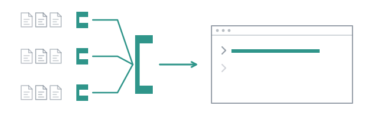

# Three scouts, one answer



A question that spans a repository has three parts hiding in it: where the
thing is implemented, how it is tested, and what the documentation claims. One
agent answering all three reads everything, and a small one gets the first part
right and drifts on the other two. Three agents answering one part each read a
third as much, at the same time, and somebody still has to put the parts
together without inventing the joints.

That shape comes up often enough to ship as a file. Look at it before you run
it:

```bash
cat flows/explore.md
```

```markdown
---
name: explore
description: Three scouts read the code in parallel, then one agent answers from what they found
input: string

nodes:
  - id: look
    map:
      - Find where the thing asked about is implemented, and name the files.
      - Find how it is tested, and what the tests actually assert.
      - Find what documents it, and whether that matches the code.
    concurrency: 3
    do:
      - id: find
        agent: scout
        reads: [input, item]
        on-fail: continue

  - id: answer
    agent: synthesiser
    reads: [input, look]
---

## find
Do the task under `item` about the question under `input`. Report what you
found with file paths and line numbers, and say plainly when you found nothing:
an empty report is worth more than a guess.

## answer
Answer the question under `input` from the three reports under `look`. Where
they disagree, say so rather than picking one; where they are all silent, say
that too.
```

Two nodes. A `map` over three **literal** tasks, whose one node is a scout's
turn, then a synthesiser that reads the question and the three reports. Each
turn is handed exactly what its `reads:` names, each under its own heading.
Nothing in the file decides anything at run time: our code walks it, and the
only thing a model chooses is what to write.

## Run it

```
/run explore how is the wall time of a subagent measured, and where
```

The flow's plan appears above the prompt at once, and fills as it goes:

```
● explore · 1 visit · 9s · ↑19k ↓559
● look · 1/3
  ✓ look[1] · 9s · ↑19k ↓559
  ● look[2]
    ● look[2]/find
      ● scout#2  read test/measured.test.ts  provider/model · ↑0 ↓0 · 8.4s
  ● look[3]
    ● look[3]/find
      ● scout#3  read src/subagent.ts  provider/model · ↑0 ↓0 · 8.4s
○ answer · agent synthesiser (.pi/agents/synthesiser.md) · reads input, look · timeout 30m by default · ≤ 1 turn · ≤ …
esc stops everything · ctrl+↑↓ selects · ctrl+del stops the selected one
```

`look[1]` has finished and folded to one line. A scout's tokens stay at `↑0 ↓0`
until its turn ends, because pi reports them then. Watch `scout#2`: it greps,
reads `src/subagent.ts`, then `test/measured.test.ts`, then
`test/trail.test.ts`. That is the branch that was asked about tests, and you
can see it doing that and nothing else. When the last scout closes, the
synthesiser runs alone for eight seconds, and the answer lands **in the
conversation**:

```
◆ explore
Result of the explore flow, asked to: how is the wall time of a subagent measured, and where.

The wall time of a subagent is measured as the elapsed time from when it is spawned until it is closed (or until the
current time if it is still active) using a monotonic clock via performance.now(). This logic is implemented in
src/subagent.ts.

The reports disagree on the exact line numbers in src/subagent.ts:
- Report 1 cites lines 205 (spawn), 233-236 (usage getter), and 332 (final capture).
- Report 2 cites lines 203 (spawn), 235-238 (usage getter), and 341-342 (final capture).
- Report 3 cites lines 168 (spawn), 216-220 (usage getter), and 308-310 (final capture).

Additional details:
- Documentation: src/usage.ts describes the wallMs field as "From spawn to close, waiting included. Monotonic clock."
- Testing: Tests in test/measured.test.ts and test/trail.test.ts verify that wall time corresponds to actual elapsed
  time rather than a sum of individual step durations or the sum of parallel branches in a fan-out scenario.

ok · runs/2026-09-23_22-02-06

✓ explore · 5 visits · 44s · ↑131k ↓4.8k
✓ look · 3 items · 36s · ↑129k ↓3.5k
✓ answer · synthesiser · 8s · ↑2.1k ↓1.2k
```

That is the frame, verbatim. The line under the answer says how the run
ended and where it is on disk, and the last three lines are the plan as it
finished, drawn for you and not sent to the model.

## Read the disagreement

The three scouts each read `src/subagent.ts` whole and reported three
different line numbers for the same statement. The synthesiser was told to say
so rather than pick one, and it did. Settle it yourself:

```bash
grep -n spawnedAt src/subagent.ts
```

```
217:	const spawnedAt = performance.now();
283:			return { ...usage, wallMs: performance.now() - spawnedAt };
387:			const finalUsage = { ...usage, wallMs: performance.now() - spawnedAt };
```

All nine numbers were wrong. The content was right three times over: the
mechanism, the clock, the three places. The line numbers were a small model's
guess written as a citation. Had one scout answered alone you would have had
one confident wrong number and no way of knowing. Three that disagree tell you
something; an answer that averaged them, or took the first, would have hidden
it.

The synthesiser works by one rule, and so should anything that folds several
agents' work into one: a report is a claim, not evidence. A branch that fails
comes through the same way: `on-fail: continue` turns a failed scout into a
failed report in its slot, so the answer can say "not covered" instead of
answering from two reports as if there had been three.

## What it cost, and where that is written

Open the folder the answer named. It is the run directory:

```bash
find runs/2026-09-23_22-02-06 -type f -not -path '*/.sessions/*' | sort
```

```
runs/2026-09-23_22-02-06/answer/synthesiser.html
runs/2026-09-23_22-02-06/answer/synthesiser.jsonl
runs/2026-09-23_22-02-06/journal.jsonl
runs/2026-09-23_22-02-06/look[1]/find/scout.html
runs/2026-09-23_22-02-06/look[1]/find/scout.jsonl
runs/2026-09-23_22-02-06/look[2]/find/scout.html
runs/2026-09-23_22-02-06/look[2]/find/scout.jsonl
runs/2026-09-23_22-02-06/look[3]/find/scout.html
runs/2026-09-23_22-02-06/look[3]/find/scout.jsonl
runs/2026-09-23_22-02-06/main.jsonl
runs/2026-09-23_22-02-06/snapshot.json
runs/2026-09-23_22-02-06/usage.json
```

One transcript per turn, under the visit that ran it and rendered by pi
itself. `snapshot.json` is the flow as it was checked, `journal.jsonl` every
visit as it ended, which is what a resume reads; `main.jsonl` is your own
session. `.sessions/`, left out above, is where pi kept the sessions those
transcripts were exported from. And `usage.json`:

| subagent | wall | input | output | what it did |
| --- | --- | --- | --- | --- |
| scout#1 | 8.4s | 19.4k | 559 | three tool calls, the implementation |
| scout#2 | 15.4s | 45.5k | 1.3k | five tool calls, the tests |
| scout#3 | 35.4s | 63.7k | 1.7k | six tool calls, the docs |
| synthesiser#1 | 7.8s | 2.1k | 1.2k | no tool call, the answer |
| **run** | **43.3s** | **130.7k** | **4.8k** | parallelism 1.55 |

`parallelism` is busy time over wall time: 67 seconds of work happened in 43.
Three scouts did not give three times the speed, because the slowest branch
sets the pace and the synthesiser waits for all of them. That number is in
`usage.json` because it answers "was the fan-out worth it", and nothing on
screen could have told you.

The slowest branch is worth a look. `scout#3` was asked what documents the
wall time, and one of the six files it opened was
`docs/tutorials/03-keep-the-session-out.md`, the next page of this tutorial,
whose frame quotes a scout's report with line numbers in it. A document that
quotes a model is one more claim, and a scout reading it cannot tell.

`cost` reads `0` in every row. That provider reports no cost, and combo does
not estimate one from characters: a zero here means "not reported", never
"free". [Measurements](../guide/measurements.md) says what is counted and what
is refused.

## The answer is in your context now

Look at the status line: `0.0%` before, `0.2%` after. The answer arrived as a
message the model can read, prefixed with what produced it, so the next thing
you type can lean on it:

```
> and is busyMs measured the same way?
```

> No, **`busyMs`** is measured differently than `wallMs`.
>
> While `wallMs` tracks the total elapsed time from when a subagent is spawned
> until it is closed (or queried), `busyMs` tracks only the time the subagent
> was actively working. …

That is `/run`'s reason to put the answer there: an exploration you have to
paste back into the conversation yourself is a report in the wrong place.

It is also what it costs. Before answering, the session took the report's
word for where to look and read `src/usage.ts` and `src/subagent.ts` itself,
and the status line went from `0.2%` to `18.4%`: the files the scouts read so
that you would not have to were now in your window after all. A main model
that has read a report starts acting on it. It becomes the orchestrator, and
every step you ask for next is chosen against a conclusion it already holds.
When the window is meant to stay a console, what reaches it changes the
answers.

**Next:** [Keep the session out of it](03-keep-the-session-out.md).
