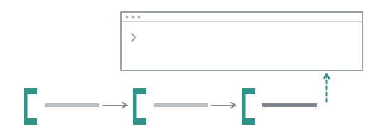

# Keep the session out of it



Here is a failure that is hard to see because it looks like competence. You
ask the session to have a scout find something, then a planner to plan from
it, then a coder to build the plan. Each report lands in the conversation, the
main model reads each one, and by the third step it is no longer relaying your
instructions: it is an orchestrator with a view of its own, and it phrases the
coder's task against a conclusion it drew from the scout's report two steps
ago. Nothing is wrong, exactly. You are no longer the one deciding.

`/step` runs one stage at a time, an agent or a whole flow, and tells the
session **nothing**. Every result is drawn in the transcript for you to read,
carried to the next step by the extension, and kept out of the model's context
until you put it there.

## Walk it

```
/step scout where is the wall time of a subagent measured
```

One dot, then the report appears in the transcript:

```
◇ scout agent  1 turn  outside this conversation - /quote puts it in
  The wall time of a subagent is measured in src/subagent.ts by recording the time of its creation and calculating the
  elapsed time using performance.now().

  - src/subagent.ts:167: records the spawn time: const spawnedAt = performance.now();.
  - src/subagent.ts:201-204: the usage getter calculates the current elapsed wall time: return { ...usage, wallMs:
    performance.now() - spawnedAt };.
  - src/subagent.ts:316: the final wall time is captured during the close() process: const finalUsage = { ...usage,
    wallMs: performance.now() - spawnedAt };.

scout: 1 turn - /step <next> carries it on, /quote puts it in this conversation
```

The header and the last line carry the whole contract between them: the report
is outside this conversation, and the next step is what gets handed it. The
body is indented under the header rather than drawn flush left, because flush
left and full width is exactly how an answer the session gave is drawn.

```
/chain
```

```
1. scout  agent where is the wall time of a subagent me…  1 turn
1 step, 1 turn - exported to /…/combo/runs/2026-09-24_00-47-28
```

Now the second step, with no instruction beyond a question. It receives the
scout's report as its input:

```
/step reviewer is the measurement trustworthy
```

```
◇ reviewer agent ←scout  1 turn  outside this conversation - /quote puts it in
  LGTM

reviewer: 1 turn - /step <next> carries it on, /quote puts it in this conversation
```

```
/chain
```

```
1. scout     agent where is the wall time of a subagent me…  1 turn
2. reviewer  agent ←scout is the measurement trustworthy  1 turn
2 steps, 2 turns - exported to /…/combo/runs/2026-09-24_00-47-28
```

The arrow says what the reviewer was handed. Both steps were exported into one
folder, `1-scout/` and `2-reviewer/`, each with its transcript and its own
`usage.json`.

## Read what happened before anything acts on it

Look at that `LGTM`. The reviewer opened `src/subagent.ts`, thought it
through, and answered with the one word its definition allows for approval.
Its reasons are in its transcript and nowhere in the step. Look at the
scout's report too: none of its three line numbers is right (the lines are
`217`, `283` and `387`), and the reviewer approved a report with three wrong
citations in it, because it was asked about the measurement and not about the
report. Its own thinking had put the three statements at `167`, `202` and
`316`: the scout's numbers, not the file's.

Nothing acted on that. Had this been `/run` on a flow, the next node would
have been handed `LGTM` as its input and carried on. Here it is a line in the
transcript, and you are the join between the steps: you read it, you decide
whether the reviewer was asked the right thing, and you type a better step or
none. That join is what walking by hand buys, at the cost of typing each step.

Now ask the session:

```
> what did the reviewer say?
```

No reviewer ran in its conversation, and its thinking said so: "I don't have
any active subagent sessions or recent logs in the current context". Then it
went looking. It listed `runs/` with `bash`, found
`2-reviewer/reviewer-1.jsonl`, read it, and summarised the reviewer's
reasoning, ending "The final verdict was: **LGTM**."

The two steps were not in its context, which is what you asked for. They were
on disk, in the working directory of a session that holds `bash`. `/step`
keeps a result out of the conversation; it does not hide the run directory
from a model that can list files. When the point is that the session must not
lean on a step, do not ask it about one.

## Let it in, one step at a time

```
/quote
```

```
◆ chain · scout → reviewer
Result of the reviewer step of the chain, asked to: is the measurement trustworthy.

LGTM

quote: reviewer is now in this conversation
```

Now it is in. `/quote` sends the last step by default, or `/quote 1` for the
scout, and it arrives **attributed**: pi hands the text to the model in a user
slot, and an unattributed report sitting in a user slot reads as an
instruction. The two lines of framing are what turn it back into a result of
something that ran.

## A stage can be a flow

`/chain reset`, then name a flow where you named an agent:

```
/step explore where is the wall time of a subagent measured
/step reviewer is the answer consistent with the code
/chain
```

The flow's plan is drawn above the prompt while it runs, as `/run` draws it,
and its answer lands where a step's does, outside the conversation:

```
◇ explore flow  4 turns  outside this conversation - /quote puts it in
  The wall time of a subagent is measured in src/subagent.ts using performance.now(). It is calculated as the
  difference between the current time and a spawnedAt timestamp recorded when the subagent is created.

  This measurement occurs at three points:
  - During the spawn process (where spawnedAt is initialized).
  - Within the usage getter (to provide the current elapsed wall time).
  - In the close method (to capture the final total wall time).

  The reports disagree on the specific line numbers where these occur:
  - Spawn: reported as line 163, 184, or 217.
  - Usage: reported as lines 205-208, 224, or 283.
  - Close: reported as line 267, 343, or 387.

explore: 4 turns - /step <next> carries it on, /quote puts it in this conversation

◇ reviewer agent ←explore  1 turn  outside this conversation - /quote puts it in
  LGTM

1. explore   flow where is the wall time of a subagent me…  4 turns
2. reviewer  agent ←explore is the answer consistent with the code  1 turn
2 steps, 5 turns - exported to /…/combo/runs/2026-09-24_00-50-38
```

The chain says which stage was a flow. The flow's run directory is the step's
folder, `1-explore/`, so a stage that stops can be carried on with `/run
resume` like any run.

And read the reviewer once more, in its transcript this time. It opened
`src/subagent.ts`, put the getter at `267` and the close at `343`, two numbers
it had from the reports and not from the file, then saw a `grep` of its own
disagree and took the grep's `217`, `283` and `387`. One scout had those three
numbers right, and the answer lists them beside the wrong ones. The reviewer
checked the claim against the file and said `LGTM`, and the one word is all
the step shows. That is the thing a step drawn outside the conversation is
for: the claim waits on your screen until you have checked it, and the
transcript says how the reviewer checked it.

## A different model per step

The step is where the model is chosen. A plan is worth a large model, the
coding it describes often is not, and a review is. `--model` on a step applies
to that step alone:

```
/step --model anthropic/claude-opus-5 planner three steps at most, no refactor
/step --model <provider/small-model> coder
/step --model anthropic/claude-sonnet-5 reviewer
```

A step with no `--model` runs on the agent's own `model:` if it names one, and
on pi's settings if it does not. The model your session happens to be on is
never the default: a subagent running on whatever the operator's TUI is on is
the same hole one level up.

Two more flags, and then the command is learnt:

- `/step --from 1 coder` carries the scout's report instead of the last step.
  `--from none` starts from nothing.
- `/step --agent scout …` when a flow and an agent share a name. A `<name>`
  is resolved against the flows first, because a stage of a chain is often
  a whole flow, as `explore` was above.

`/chain reset` drops the chain. The next `/step` starts a new one, in a new
folder.

## What a step is handed, byte for byte

Every step after the first receives two sections. This is the reviewer's
turn, from its transcript:

```markdown
## Request

is the measurement trustworthy

## Output of step `scout`

The wall time of a subagent is measured in `src/subagent.ts` by recording the time of its creation and calculating the elapsed time using `performance.now()`.
…
```

Your instruction is the request, and what came before is labelled with the
step it came from. A step that names a [flow](../guide/flows.md) is started on
the same two sections, as its `input`.

By the third time you have typed `scout`, then `planner`, then `coder`, the
chain exists. The next page writes it down.

**Next:** [Write the chain down](04-write-it-down.md).
