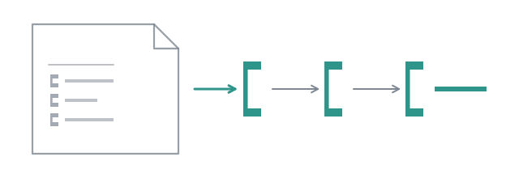

# Write the chain down



By the third time you have typed the same two steps, the workflow exists. It
lives in your shell history, where nobody can review it, nobody else can run
it, and a change to it is not a diff. Most agent tooling answers that with a
YAML file and a templating language. Within a year it has `if:` and
`${{ steps.x.outputs.y }}`, and it is a programming language with none of the
tools of one.

A combo flow is a Markdown file next to your agents, and it refuses to become
that. It is built from a closed set of nodes, it runs no code of its own, it
has no templating, and it is checked whole before anything is spawned. The
moment a run needs something the nodes cannot say, it is TypeScript, and the
file has done its job by making that boundary visible.

## The problem worth a file

Documentation drifts from code. Every repository has a page that says a
default is 4 when the code says 2. The reading is always the same: one agent
reads the code, one reads the docs, one compares. Put it in
`.pi/flows/docs-drift.md`:

```markdown
---
name: docs-drift
description: One scout reads the code and one reads the guide on a topic, then one agent lists where they disagree
input: string

nodes:
  - id: read
    parallel:
      code:
        - id: in_code
          agent: scout
          reads: [input]
      guide:
        - id: in_guide
          agent: scout
          reads: [input]

  - id: compare
    agent: synthesiser
    reads: [input, read]
---

## in_code
Read the code under src/ only, and report what it does about the topic under
`input`: one claim per line, with file and line. Say plainly when you find
nothing there.

## in_guide
Read docs/guide/ only, and report every claim the guide makes about the topic
under `input`, quoted, with the page it comes from. Say plainly when you find
nothing there.

## compare
List every place where the guide and the code disagree about the topic under
`input`. The two reports are under `read`: `code` says what the code does,
`guide` what the guide claims. One line each, quoting the claim and naming the
file that contradicts it. Where they agree, say nothing. If they agree
everywhere, say so in one line.
```

Frontmatter carries the structure: which nodes, which agents, what each one
reads, because that nests and YAML nests for free. The body carries the prose,
one `## <id>` section per agent turn, because a ten-line instruction inside a
YAML block scalar is miserable to write and Markdown is what prose is for.

`input: string` says what the flow is started on: the text after its name.
`parallel` runs its two branches at once. `reads:` is the whole data model: a
turn is handed what it lists, each under its own heading, and nothing else.
`compare` cannot read `in_code` directly, because a node inside a block is
not visible outside it; it reads `read`, the block's output, which holds each
branch as it ended.

## See it loaded

```
/flows
```

```
6 flows
build           project  ≤ 113 turns · ≤ 29h50m                      Locate the code, split the work, implement it in
                                                                     pairs, check and audit the whole
build-attended  project  ≤ 121 turns · ≤ 33h50m + a person's answer  Interview the user, confirm, build, then commit
                                                                     on the run's branch
docs-drift      project  ≤ 3 turns · ≤ 1h                            One scout reads the code and one reads the guide
                                                                     on a topic, then one agent lists where they
                                                                     disagree
explore         project  ≤ 4 turns · ≤ 1h                            Three scouts read the code in parallel, then one
                                                                     agent answers from what they found
interview       project  ≤ 7 turns · ≤ 3h30m + a person's answer     Ask the user one question at a time, then write a
                                                                     specification
split           project  ≤ 6 turns · ≤ 2h                            A planner splits a read-only question between a
                                                                     scout and a reviewer, then one agent answers
```

Yours sits beside the shipped ones, with its worst case: three turns, an hour
at most, because each turn is bounded by a 30-minute default and the two
scouts run at once. Nothing is estimated there; every loop and every `map` in
a flow carries a `max:`, so the most a flow can cost is known before it runs.
`/flows docs-drift` prints the plan that bound comes from:

```
docs-drift · .pi/flows/docs-drift.md · input string · ≤ 3 turns · ≤ 1h
○ read · parallel · ≤ 2 turns · ≤ 30m
  ○ read/code
    ○ read/code/in_code · agent scout (.pi/agents/scout.md) · reads input · timeout 30m by default · ≤ 1 turn · ≤ 30m
  ○ read/guide
    ○ read/guide/in_guide · agent scout (.pi/agents/scout.md) · reads input · timeout 30m by default ·
      ≤ 1 turn · ≤ 30m
○ compare · agent synthesiser (.pi/agents/synthesiser.md) · reads input, read · timeout 30m by default ·
  ≤ 1 turn · ≤ 30m
```

A file in `.pi/flows/` is visible from this repository only; one in
`~/.pi/agent/flows/` follows you everywhere. The same name in both, and the
repository's wins, so replacing a shipped flow is writing a file called
`build.md`, not deleting anything.

## Run it

```
/run docs-drift the default lifetime of a subagent, and who decides it
```

Two scouts, then the synthesiser, then the comparison lands in the
conversation, prefixed with the flow that produced it exactly as
[`explore`](02-three-scouts.md) was:

```
Result of the docs-drift flow, asked to: the default lifetime of a subagent, and who decides it.

They agree everywhere.

ok · runs/2026-09-23_22-18-00

✓ docs-drift · 4 visits · 33s · ↑38k ↓1.6k
✓ read · 2 branches · 27s · ↑37k ↓1.4k
✓ compare · synthesiser · 6s · ↑1.5k ↓252
```

One line, thirty-three seconds, 38k input tokens for the whole run. An
anticlimax is the correct result of a drift check on a page that is right, and
a flow that only ever finds something is one you should distrust.

What the last turn received is worth reading once, because it is the whole
data model. It is the first message of `compare/synthesiser.jsonl` in the run
directory:

````markdown
List every place where the guide and the code disagree about the topic under
`input`. The two reports are under `read`: `code` says what the code does,
`guide` what the guide claims. One line each, quoting the claim and naming the
file that contradicts it. Where they agree, say nothing. If they agree
everywhere, say so in one line.

## input

the default lifetime of a subagent, and who decides it

## read

```json
{
  "code": {
    "ok": true,
    "output": "- `src/agent.ts:19-23`: The possible lifetimes are `\"task\"` (born and dies with each task), …\n- `src/subagent.ts:63`: The default lifetime is `\"task\"`.\n- `src/subagent.ts:166`: The lifetime is decided by the `lifetime` option passed to `spawn()`, falling back to the `lifetime` declared in the agent's frontmatter, and finally falling back to the `\"task\"` default."
  },
  "guide": {
    "ok": true,
    "output": "In `docs/guide/lifetime.md`:\n\n- \" `\"task\"` *(default)* \" (line 8)\n- \"Resolution order, always: the explicit argument, then the agent's frontmatter, then `\"task\"`. Persistence is asked for. It is never obtained by accident.\" (lines 14-15)"
  }
}
```
````

Its own section first, then each address it reads, under the address as its
heading. Each branch comes with whether it ran. As written, a scout that fails
ends the run; give both `on-fail: continue`, as `explore` does, and a failed
one reaches the synthesiser as `"ok": false` in its slot instead.
The prose names the headings it will find, `input` and `read`: a turn holding
two reads has two sections, and "the reports below" would point at neither.

## What a typo costs

Change one letter and run it again:

```yaml
  - id: compare
    agent: synthesizer
```

```
/run docs-drift the default lifetime of a subagent
```

```
Error: run: `docs-drift` is refused
  .pi/flows/docs-drift.md compare.agent: `synthesizer` is unknown; did you mean `synthesiser`?
```

It stopped before spawning anything. The file was parsed, every node's shape
was checked, every section was matched to an agent node, every address and
every agent name was resolved, all before a single session opened. A typo in
the last node costs a second, not two scouts' worth of real work followed by a
failure. The fault names the file, the node and the key, `compare.agent`.

Now put the name back, delete the `## compare` section, and run `/flows`:

```
5 flows, 1 file refused
…
docs-drift      project  broken
  .pi/flows/docs-drift.md compare: `compare` is an agent node and has no `## compare` section
…
```

The refused entry and its fault are the two lines drawn in the warning colour;
the rest is the listing as before. A refused flow is **never** silently skipped. An agent file missing its
`name` is dropped without a word, following pi, because agents are discovered;
a flow is asked for by name, and answering "unknown flow" about a file sitting
right there would be a lie. The most likely reason anyone runs `/flows` is
that something did not load, so the refused ones are what the listing is for.
`/flows` checks and spawns nothing, so it needs no model.

## What the file cannot say

A flow can branch, repeat and fork: a `choice` takes the first case whose
condition holds, a `loop` runs until its condition holds, a `map` runs its
body once per item. What it cannot do is let a model or a string decide the
shape of the run:

- A model produces values, never the next node. A condition is a small subset
  of CEL that reads **typed** outputs, `audit.output.approved`, and is
  type-checked before the first spawn. An agent's text is read whole and never
  into, so no condition can hang on the wording of a paragraph.
- There is no templating. A node lists its `reads:`, and the runner hands it
  those values under their names. Nothing is interpolated into a prompt.
- A flow runs no code. A `check` names a script of the project, and its exit
  code is the verdict.
- Every loop and every `map` has a `max:`. Forever is not reachable by
  forgetting an argument, and `/flows` prints what the worst case costs.
- `model:` at the top level puts every agent turn of the file on one model,
  and a `--model` on the command beats it.

When you need more than that, the same two reads and a comparison in
TypeScript are a few lines, and every combinator is a function you can call.
That is where [Workflows](../guide/workflows.md) picks up. The whole format,
every node and every fault, is [Flows](../guide/flows.md).

The flow used our agents. The next page writes one of yours, and the first
thing it decides is what the agent may not do.

**Next:** [An agent that cannot do harm](05-an-agent-that-cannot-write.md).
