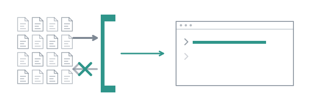

# An agent that cannot do harm



Every agent framework has the same paragraph in its documentation: "instruct
the agent not to modify files it was not asked to". Here is what that
paragraph is worth. An example in this repository once gave its coder the full
toolset and asked it, in the system prompt, to change nothing. In a plain demo
run it edited `src/usage.ts`. Twice.

A prompt is not a permission boundary. The toolset is. The agent you are about
to write starts from what it may not do.

## The problem worth an agent

Test names lie. `test("handles errors correctly")` asserts that a function
returns without throwing, and a reviewer reading the name signs off on error
handling nobody tested. Reading assertions one by one is tedious, and tedious
is what a small model is good at.

Write `.pi/agents/test-reader.md`:

```markdown
---
name: test-reader
description: Reads a test file and reports what each test really asserts, against what its name promises
tools: read, grep, find, ls
lifetime: task
---

You read tests. You never write code, and you never run anything.

Given a test file, go through every test in it and report, one line each:
its name, what it actually asserts, and whether the name promises more than
the assertion checks. A test that only asserts "does not throw" or asserts on
a value it set up itself is worth naming.

Read the code under test when you need to know whether an assertion is
meaningful. End with the two or three tests whose name promises the most and
whose assertion checks the least.
```

Three fields matter more than the prose.

`tools:` is an allowlist pi enforces. This agent holds `read`, `grep`, `find`
and `ls`. There is no `write`, no `edit`, no `bash`, so there is nothing to
instruct it not to do; leaving `tools:` out gives the same four, which is the
default for anything that explores.

`description:` is not decoration. It is what a router reads to pick an agent,
and what a planner reads to assign it a subtask. A vague description produces
vague routing, and no parser repairs that.

`lifetime: task` says a fresh one is spawned per call and closed after. Ask
twice, get two readers who never met.

## See it, and use it

```
/agents
```

```
project · /…/combo/.pi/agents
  …
  test-reader  Reads a test file and reports what each test really asserts, against what its name promises
```

It is listed under `project` because it lives in the repository. That group
has a rule the other two do not, which is why the call below names a scope:

```
> use subagent with scope "project" and agent "test-reader" to read
  test/loop.test.ts
```

A repository's `.pi/agents/` is repository-controlled content. Its prompts are
instructions written by whoever committed them, and a clone you just pulled is
a stranger's file until you have read it. So project agents are **never loaded
by default**: the `subagent` tool reads the shipped agents and yours from
`~/.pi/agent/agents/`, and a repository's only when the call says `scope:
"project"` or `"both"`. `/run` and `/build` load all three, because a person
typing a command inside a repository is the explicit request. Asking is one
word. Being handed a stranger's instructions by surprise is not acceptable,
and the boundary is a security decision rather than a preference.

It read one file, for eighty seconds on a small model, and came back with a
line per test:

```
subagent single test-reader
  Read test/loop.test.ts
✓ test-reader#1 Read test/loop.test.ts
    read test/loop.test.ts
1 turn 80.3s ↑4.8k ↓4.2k $0.0000
```

> - `caps the loop, and defaults to 5`: asserts that the loop stops at 5
>   iterations by default when the condition is never met; promise matches
>   assertion.
> - `hitting the cap is reported as not converged, even when every turn was
>   fine`: asserts that reaching `maxIterations` results in `converged:
>   false`; promise matches assertion.
> - …
>
> The tests are generally precise. The ones promising the most while checking
> the least are:
> - `an async until is awaited: the judge is often a test run`
> - `the same scenario spawns a different number of subagents per lifetime`

Eighteen tests, eighteen lines, two named at the end. Whether it is right about
those two is a question for whoever wrote them. It did the tedious part and
left the judgement where it belongs.

## Try to make it write

Now ask for the thing it cannot do:

```
> use subagent with scope "project" and agent "test-reader" to read
  test/loop.test.ts and rename any test whose name overpromises
```

This is what the session did, on a small open-weight model:

> The subagent itself cannot edit files unless it has the edit tool. Does
> test-reader have the edit tool? I don't know the definition of test-reader.
> Let's see if I can find the test-reader agent definition to see its
> capabilities.
>
> The test-reader agent only has read, grep, find, ls. It cannot edit files. So
> I will use the subagent to identify the tests that overpromise and then I
> will perform the rename.

It found the file, read the frontmatter, understood the allowlist, and routed
around it. The subagent read and reported. Then the **session**, which holds
`edit`, renamed the tests:

```bash
git status --short test/
```

```
 M test/loop.test.ts
```

The boundary held where it was drawn: the agent you wrote could not write, and
did not. The agent you did not write, the one you are typing into, has every
tool your pi gives it and a request from you that said "rename". A toolset
bounds the agent that holds it and nobody else. If the working tree must not
change, do not ask the session that can change it. `/run` and `/step` put no
model between you and the subagent, so there is nothing to route around.

The other thing that can happen is the one to plan for. A weaker model emits a
call to `edit` from inside the subagent anyway. pi refuses it, because the tool
is not in that session, and the model gets an error back and tries again, and
again. That retry is the argument for a deadline on every call, which is what
[watch the meter](10-the-meter.md) is about. Widening the allowlist to stop
the retries is the one fix that is always wrong.

## Whose name wins

Write a file called `scout.md` in `.pi/agents/` and the shipped `scout` is
gone from this repository, replaced by yours. Precedence runs from the least
specific to the most: shipped, then `~/.pi/agent/agents/`, then the
repository's. Nothing is removed to override something, and `/agents` shows a
name once, under the source that won it.

The other way round is a guarantee worth knowing: the extension **can never
take a name from you**. Its agents sit at the lowest priority by construction.

## What it inherits from you

Nothing. The system prompt is the file's body, through combo's own resource
loader: none of your extensions, none of your context files, none of your
settings, not even the model your pi is running on. Two lines are appended,
and neither is inherited state: where it stands (its working directory,
without which a model guesses a path and gives up) and which language to
answer in (the one the work is written in).

Everything an agent can do is therefore readable in its own file: the tools it
holds, the model it will run on if it names one, how long it lives. The next
page relies on that when it teaches this agent a rule.

Not everything an agent should know fits in a system prompt. A checklist of
assertion smells is a page, and it is the same page for every agent that reads
tests.

**Next:** [Teach it a house rule](06-teach-it-a-rule.md).
