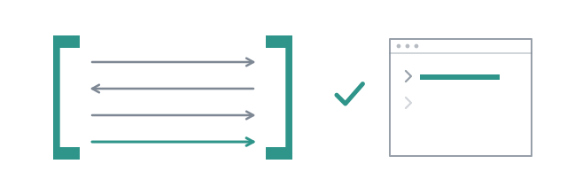

# Two agents arguing until LGTM



An agent that reviews its own work approves it. Not always, and not out of
laziness: it wrote the code with a model of what the code does, and it reads
the code through the same model. The mistake it made is the mistake it cannot
see. The oldest answer is a second reader, and the shape is a loop: one
writes, one reads, and the loop ends when the reader has nothing left to say.

How it ends is where the questions are.

## Run it somewhere it may write

The coder holds `edit` and `write`. It will use them, so do this in a clone
you can throw away:

```bash
git clone combo /tmp/play && cd /tmp/play && pi -e extension
```

Then, as a sentence:

```
> use subagent with steps coder then reviewer, looping until LGTM with lifetime
  workflow, to add a two-line usage example to the TSDoc comment of saysWord in
  src/text.ts
```

```
● coder#1  edit src/text.ts
  provider/model · ↑8.1k ↓1.1k · 10.1s
```

Then the reviewer, then the row:

```
subagent loop coder [workflow]
  Add a two-line usage example to the TSDoc comment of the `saysWord` f…
✓ coder#1 Add a two-line usage example to the TSDoc comment…
    read src/text.ts
    edit src/text.ts
✓ reviewer#1 I added a two-line usage example to the TSDoc of …
    verdict argument=The added usage examples in t…
2 turns 29.4s ↑15k ↓2.5k $0.0000  1 iteration  converged
```

And the text the model reads:

```
## coder
I added a two-line usage example to the TSDoc of the `saysWord` function in `src/text.ts`.

Changed files:
- `src/text.ts`

## reviewer
LGTM

(converged after 1 iteration(s))
```

The diff is real:

```diff
  * loop forever waiting for a verdict already given. Decoration is stripped, case
  * is ignored; a line with anything else on it still does not count.
+ *
+ * `saysWord("**LGTM**", "lgtm")` is `true`.
+ * `saysWord("LGTM, but check this", "LGTM")` is `false`.
  */
 export function saysWord(output: string, word: string): boolean {
```

The coder read the function's own comment and wrote two examples that are
correct, which on a small model is not a given.

One thing in the frame that was not asked for: after the tool returned, the
session doubted it. "It just said 'I added' and the reviewer said 'LGTM'
immediately. It's possible the coder subagent tried to use a tool or just
hallucinated that it did. Let's check if src/text.ts was actually changed."
And it read the file. That is the session doing the reviewer's job one level
up, and it is why the tool row lists the calls: `edit src/text.ts` is a fact,
"I added" is a claim.

## How it ends: the word

`until LGTM` is read by `saysWord`, and the rule is **whole line**: the loop
stops when the word stands alone on one of the reviewer's lines, whatever
decoration the model put around it. `**LGTM**` counts. `LGTM.` counts. The
line `I cannot say LGTM yet` does not, and that exact sentence is why the rule
is not "contains": a substring match once ended a review on it.

The reviewer in the row also did something else: it called `verdict`. Its
definition names that tool, so every workflow that spawns it hands it over. In
a `loop` the word is what is read, and the call rides along as a record. In a
flow node written with [`verdict:`](../guide/flows.md#ledgers-and-verdicts),
the call **is** the decision, and the prose beside it is the argument. Prefer the tool when you write your own reviewer: a
word has to be recovered from prose written for a human, and a tool call is a
discrete event with a schema. "Did it decide" and "what did it decide" become
closed questions.

## How it ends: the cap

`maxIterations` defaults to 5, and hitting it is reported apart from success.
Run a loop a weak coder cannot finish and the row ends with the other word:

```
…  5 iterations  NOT converged
```

`ok` would be true: every turn ran without a model error. `converged` is false:
the work never reached the bar. Collapsing those two into one boolean would
hide the only thing worth knowing, so a loop reports both, and a flow's `loop`
that reaches its `max:` **fails** with `unconverged` rather than handing the
next node work that nobody approved.

## Team, or fresh eyes

`lifetime workflow` in the call is why there is one `coder#1` and one
`reviewer#1` for the whole run. The coder remembers the review it was given;
the reviewer remembers what it already asked for and does not ask again. That
is a team, and it converges fast. It also drifts: a reviewer that has approved
the shape of the code twice reads the third version through that approval.

Leave `lifetime` out and the default is `task`: brand new subagents at every
iteration. Every review starts from the code alone, with no memory of what it
said last time. More re-reading, more tokens, and a reviewer that cannot be
talked into anything because it was not there for the argument. Neither is
better. Say which one you meant, every time.

## What approval is worth

A reviewer's yes is not the end of the argument, only of the reviewer's part
in it. Measured on a small open-weight model, a reviewer holding the
`verdict` tool called it correctly and approved a function that computed
`a - b` while claiming to add. A clean channel does nothing about a wrong
judgement.

So in a flow, finished is a **ledger**. Every remark the reviewer raises
becomes an obligation with an id combo assigns; later rounds list the open ones
and ask the reviewer what became of each, by id; only the agent that raised one
can close it. `approved` then means two
things at once: the reviewer had nothing further to ask, and nothing it raised
is still open. A reviewer that says yes over an obligation it never closed has
not finished the work, and the result names the ids that are left.

Which leaves the question the row above cannot answer. The reviewer read the
diff and said LGTM. Did anything run?

**Next:** [Reading code is not running it](08-build.md).
