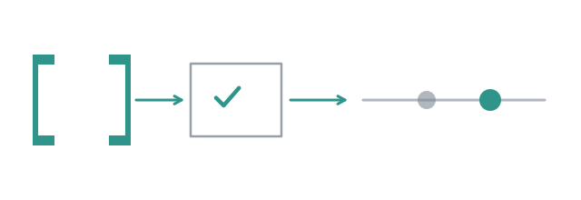

# Reading code is not running it



A pair once wrote a helper and its tests. The reviewer approved. The auditor,
reading the whole, approved. The test file imported `./slugify.js` for a file
named `slugify.ts`, and the suite never loaded. Both agents had read the code.
Neither had run it, and nothing in either prompt would have made them: a model
reading `import "./slugify.js"` sees a plausible line.

`/run build` runs the shipped [`build` flow](../reference/flows/build.md), from
a sentence to a working tree with the change in it, and nobody is asked
anything on the way. The one thing it insists on is that your own check runs
before anyone signs.

## Give it a check

The check is a script of your project, `.pi/checks/test.sh`, and the shipped
flow names that path. This page runs on a small repository, one `words.js`
helper and its test, whose script is two lines:

```bash
#!/usr/bin/env bash
exec node --test
```

Without it, the run is refused before a single subagent spawns:

```
/run build add a slugify helper with tests
```

```
Error: run: `build` cannot run here
  .pi/flows/build.md deliver/tests.check: `.pi/checks/test.sh` is not there, from
    `/…/tut-slug`
```

The script is read when the run starts and run with `bash` after each round of
work, so what runs is what was read, whatever an agent does to the file in the
meantime. The command line holds no check: `--model` and `--timeout` are its
only flags, and everything else, the check included, is in the flow's file.
A directory that is not a git repository is refused the same way, since each
subtask works in a copy that lands back through git.

## Run it

```
/run build add a slugify helper to slug.js, with tests --model <provider/model>
```

The request is the brief, as typed. Nothing asks you to confirm it and nothing
asks for a commit at the end: a question in the middle of a run is a run
waiting for whoever left it going. When the request needs thinking through
first, `/run build-attended` interviews you on it, shows the specification and
asks "Build this?" before building.

## What runs

The widget draws the flow's plan and fills it as it goes. Three minutes into
the second of the two runs this page made, the coder had finished and the
reviewer was reading:

```
● build · 3 visits · 3m9s · ↑99k ↓11k
✓ locate · scout · 1m18s · ↑66k ↓5.1k
✓ plan · planner · 13s · ↑5.1k ↓2.1k
● deliver · #1 of 2
  ● deliver#1
    ● deliver#1/work · 0/1 so far
      ● deliver#1/work[1]
        ● deliver#1/work[1]/pair · #1 of 3
          ● deliver#1/work[1]/pair#1
            ✓ deliver#1/work[1]/pair#1/code · coder · 1m39s · ↑27k ↓4.2k
            ● deliver#1/work[1]/pair#1/review
              ● reviewer#1  read words.test.js  provider/model · ↑0 ↓0 · 11.8s
    ○ deliver#1/tests · check .pi/checks/test.sh · timeout 10m · ≤ 20m
    ○ deliver#1/audit · agent auditor (.pi/agents/auditor.md) · reads input, work, tests, diff, deliver.ledger · verd…
○ report · agent synthesiser (.pi/agents/synthesiser.md) · reads input, diff, deliver.output.last.work, deliver.outpu…
esc stops everything · ctrl+↑↓ selects · ctrl+del stops the selected one
```

A scout maps the code. A planner splits the brief into subtasks, a typed list
the flow reads rather than prose it parses; this one made one. Each subtask
goes to a **pair**, a coder and a reviewer who remember each other for three
rounds at most, the reviewer deciding through a verdict it reads from the
diff, not from the coder's summary of it.

Then your check, `deliver#1/tests`, and an **auditor** who reads the whole
change against the brief, with the check's output in front of it as evidence
it cannot argue with. What the audit raises becomes the subtasks of a second
round, and there is no third.

**The round is over when the tests pass and the auditor approves.** No
approval turns a failing script into a success: the flow's loop reads
`tests.output.passed && audit.output.approved`, and a build whose second round
ends unapproved fails.

## What it leaves

The first run of that command went through in one round, four and a half
minutes on a small open-weight model, and put its answer in the conversation:

```
Result of the build flow, asked to: add a slugify helper to slug.js, with tests.

I have implemented the slugify helper in slug.js and added a comprehensive test suite in slug.test.js. I also added a
test.sh script to run the tests.

Nothing is left to do.

ok · runs/2026-09-23_21-52-24

✓ build · 10 visits · 4m34s · ↑108k ↓16k
✓ locate · scout · 1m24s · ↑38k ↓4.6k
✓ plan · planner · 9s · ↑4.1k ↓976
✓ deliver · 1 iteration · 2m46s · ↑63k ↓10k
✓ report · synthesiser · 16s · ↑2.4k ↓303
```

The work is in the working tree, uncommitted:

```
$ git status --short
?? slug.js
?? slug.test.js
?? test.sh
```

Nobody asked for `test.sh`. The coder wrote one at the root, and the report
says so because it is written from the diff, not from what the pairs claimed.
That is what the report is for: telling you what to look at. It does not
replace `git diff`, and nothing is committed, pushed or undone on your behalf.

## Interrupt it

Every fact of a run is appended to `runs/<timestamp>/journal.jsonl` as it
happens. The same command, run again, was killed while its reviewer read; a
fresh pi, in the same directory:

```
/run resume
```

```
run: resuming build in runs/2026-09-23_21-59-40, from deliver#1/work[1]/pair#1/review
```

It says what it picked up rather than asking: typing `/run resume` was the
answer. The scout's map, the plan and the coder's work had ended, so they were
kept; the review had not, so it ran again, in the copy the coder had left
open, with a fresh reviewer that read the tree rather than a replayed
conversation. The run ended like the first one, and its summary counts both
processes:

```
✓ build · 10 visits · 4m14s · ↑146k ↓16k · 2 lives (1 partial) · resumed from deliver#1/work[1]/pair#1/review
```

The first life is `partial` because it was killed before it could write its
own measurement: it is counted from the visits it ended, and the review it was
in the middle of costs nothing on this bill, since nothing measured it.

A run that failed by a decision of its own, a second round unapproved, would
decide the same again, and `/run resume` refuses it with why.

## What this page did not show

One subtask, one coder. It did not say where two coders write when the plan
has two subtasks and the flow runs them at once, which is the whole of the next
page.

**Next:** [Two coders, one tree](09-two-coders-one-tree.md).
