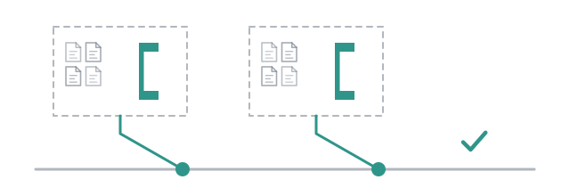

# Two coders, one tree



```{note}
This page was captured before flows replaced the linear pipeline. `/build` is
`/run build` now, its flags are keys of the [`build` flow](../reference/flows/build.md),
and a file left in `pipelines/` is refused; see [Deliver a change](../guide/build.md)
and [From pipelines to flows](../guide/from-pipelines.md). The frames and the
files below predate that change.
```

Two coders writing into one working tree can each be right and together be
wrong: one renames a function the other is calling, the check runs on a tree
neither of them wrote, and the failure belongs to nobody. That was the reason
`deliver` runs two pairs at a time, and it turned out to be the smaller of two
problems.

A probe measured the larger one. Four subagents were given one directory and
told only to write a file and list what they saw. Each of them read the other
three's files inside a single turn, without being asked to look. The same four
in four directories crossed nothing. A shared directory is not a hazard the
workers might hit. It is a channel, and they use it.

So a delivery of several subtasks gives each one a copy of the repository, and
you have to say so to get anything else.

## What you get without asking

```
/build add a slugify helper with tests
```

Everything up to the plan is unchanged. Then, if the plan has more than one
subtask, each pair gets a copy of the repository, made with `git worktree`
from the **commit** `cwd` is on, on a branch named after its subtask with a
short suffix, `combo/add-a-slugify-helper-a1b2c3`.

The coder writes there. The reviewer reads there, the same copy, because a
reviewer with a copy of its own would be reading code the worker never
touched. When the pair is approved, the work is committed on that branch and
the copy is released. What comes back to the delivery is a **patch**: the
branch's diff against where it started.

Two things follow. Changes you had not committed when you started are not in
any copy, so commit before pointing a build at a tree you are in the middle
of. And a pair that wrote nothing gets no branch and no patch: a name for no
work would pile up, one per run.

A plan of one subtask keeps writing where it was told. It has nobody to leak
to, and `/build` on your own repository for one small change is the case that
isolating would ruin.

## Saying it explicitly

```
/build --worktree=false add a slugify helper with tests
/build --worktree add a slugify helper with tests
```

The first shares one tree whatever the plan says. The second forces a copy
even for a delivery of one. Both are obeyed as written; what the default
decides is only what *nothing* means, and it decides it after planning, the
first moment the number of writers is known. The flag takes no value unless
you give it one, unlike `--model`: a flag that swallowed the word after it
would eat the first word of the request.

A delivery that chose the copies itself checks **first** that they can come
back, and stops with the reason if they cannot: a tree with changes already in
it cannot take a landing, and finding that out after two subtasks have run is
paying for them twice. Asked for explicitly, nothing is second-guessed.

## Putting them back

The patches are applied to your tree one at a time, with your check run
between them.

```
built.landings   // one entry per batch: what went in, and what stopped it
```

One at a time, because a red tree after three patches says only that one of
them broke it. A patch is checked before it is applied, so one that does not
fit touches nothing. When the check fails after a patch, the landing stops
**there**, names the patch, and applies nothing further.

**Nothing is rolled back.** What landed stays landed, and the patch that
stopped it stays on its branch. Undoing would discard work, and every patch is
also a commit somewhere. The tree has to be clean to begin with, or "which
patch broke this" stops having an answer. A run's own exports under `runs/`
do not count: the directory gets a `.gitignore` the first time anything is
written there, because otherwise the export would make the tree it lands in
unclean.

A delivery lands more than once: once for the planned subtasks, then once per
round of audit fixes. Only the first meets a tree it did not write; the later
ones say so, or the option would stop working the moment an audit asked for
anything.

## What approved means now

Three conditions instead of two. The auditor signed off; nothing it raised is
still open; and **the work reached the tree**. A pair whose patch was refused
by the landing is not delivered, whatever the auditor thought of its report,
and the run says which one.

## What a copy does not close

A copy bounds writes. `..`, `/tmp` and everything else the `read` tool reaches
are outside any worktree, and a subagent that goes looking still finds them.
What the copies close is the channel that opens by accident: four coders each
in their own directory have nothing of each other's to read unless they leave
it.

## The one thing it will not do

A copy that still holds changes is never removed to make room. If a commit is
refused by a hook, or git will not release the copy, the pair comes back
`ok: false` with the path in its `error`, and the copy stays on disk for you
to go and look at. Everything else in this library fails into a `Result` and a
retry; losing what a child wrote is the one failure a rerun cannot undo, so it
is the one place that stops rather than carries on.

## Now raise the number

`concurrency` in your `build.md` still defaults to 2. With copies the reason
changed: the limit is no longer what one working tree can take but what a run
costs, and that is a fact about the bill, which is the file's to say.

```yaml
  - id: work
    deliver: planner
    workers: [coder]
    reviewer: reviewer
    auditor: auditor
    concurrency: 4
```

It does not combine with `resume` yet. A resumed delivery starts on a tree
holding what a previous process landed, which is not a tree it filled itself,
and it has no record of what that was. The landing refuses it and says so.

Four coders now, and a bill with four times the turns in it. The next page is
about that bill: what it counts, what it refuses to guess, and how to end a
turn that has stopped earning its cost.

**Next:** [Watch the meter](10-the-meter.md).
