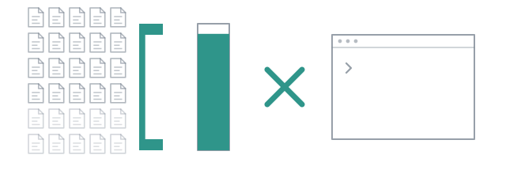

# Watch the meter



Observed in the wild, on a small model: 79 calls to a tool named `run`, which
did not exist. Each call got "unknown tool" back, and each time the model
asked again, sending the whole context with it. Around 500k input tokens in a
single turn, and nothing at the end of it.

pi's agent loop is a `while (true)` with no step cap. That is the right design
for an agent loop and the wrong thing to run unattended, which is why every
page here mentioned `timeoutMs`.

## Where the numbers come from

Nothing here is estimated. Tokens and cost come from pi's own session
statistics, which are cumulative, so a turn's usage is the difference between
two snapshots, clamped at zero because compaction can walk the totals back.
Time is ours, on a monotonic clock: `busyMs` is the sum of the turns, `wallMs`
runs from spawn to close.

Two consequences you have already seen and may not have read:

- **`$0.0000` means "not reported", never "free".** The provider in these pages
  reports tokens and no cost, and another one reported no tokens at all for a
  while. A zero is printed rather than a number counted from characters,
  because a plausible estimate is worse than an honest gap.
- **`input` counts every request, not every turn.** pi sends the whole prompt
  on each round trip, so one turn with eight tool calls sends a 14k context
  eight times, and the counter reads 110k. That is the number from
  [the first page](01-one-scout.md), and it is right. The turn is the cost,
  and the counter is telling you so.

## Read one bill

Every `/run`, `/step` and `/build` leaves a `usage.json`, and the `subagent`
tool does with `export true`. Take [the explore run](02-three-scouts.md):

```json
{
	"wallMs": 63493,
	"subagents": [
		{
			"id": "scout#2", "agent": "scout", "model": "provider/model", "ok": true, "toolCalls": 5,
			"usage": { "wallMs": 41221, "busyMs": 41214, "turns": 1, "input": 61061, "output": 1920, "cost": 0 }
		}
	],
	"total": { "subagents": 4, "failed": 0, "turns": 4, "busyMs": 98799, "input": 123580, "output": 5116, "cost": 0 },
	"parallelism": 1.556
}
```

One entry like that per subagent, four in this run, and a total underneath
that is the sum of them. The entry above is cut short: the real one also says
which lifetime the subagent ran with, its last status, the task it was given,
and - for a subagent another one spawned - the `parentId` it hangs under.
[`measure/export`](../reference/api/measure/export.md) has the whole shape.

`parallelism` is busy over wall: 98.8 seconds of work in 63.5. A fan-out of
three that reads 1.56 has its slowest branch setting the pace, and that ratio
is the only number that says whether the fan-out bought anything.
A failed subagent is in the list with its usage: a scout that crashed after
12k tokens cost 12k tokens, and dropping it would make an expensive failure
read as a cheap run.

`main.jsonl` sits beside them when the run came from the tool: your own
session's transcript, so the export tells the whole story and not the half
that happened in the subagents.

## Set the deadline

`timeoutMs` is a per-turn deadline with no default. The library does not get
to decide that a legitimate task took too long; you do.

```
> use subagent with agent "scout" and timeoutMs 120000 to find …
```

```yaml
steps:
  - id: look
    fanOut: scout
    timeoutMs: 120000
```

Per turn, not per run: a fan-out of three gets three deadlines, a loop gets one
per step per iteration. When it fires, the turn is cut short through pi's own
abort, the subagent comes back as a failed `Result`, and what it spent is on
the bill. `/interview` sets one itself, five minutes a turn, because somebody
is waiting on the next question and cannot tell a slow turn from a stuck one.

`loop` has a cap of its own, five iterations, and that one does have a default
because an iteration is a discrete, expensive unit with a meaningful small
number. `orchestrate` caps its plan at eight subtasks and fails before
spawning anything past it. "Forever" must not be reachable by forgetting an
argument, at either level.

## End it by hand

While anything runs, the line under the dots says what the keys do:

```
● scout#2  read test/export.test.ts
● scout#3  read src/subagent.ts
esc stops everything · ctrl+↑↓ selects · ctrl+del stops the selected one
```

`esc` stops every subagent of the run. Inside a model's turn pi's own
interrupt fires as well, so the turn goes with them and the model gets no
chance to delegate again; during `/run`, `/build` or `/step` there is no turn
to abort, and this is what stops them.

`ctrl+↑↓` move a `▸` through the subagents still working, delegated children
included, and `ctrl+del` stops the one it points at. On the explore pipeline:

```
▸ scout#2  read test/export.test.ts
● scout#1  read src/subagent.ts
```

```
stop: scout#2 stopped - the other subagents are untouched
✗ scout#2  stopped
  provider/model · ↑12k ↓426 · 8.0s
```

Be quick about it. The first attempt at that frame had `scout#3` selected, and
by the time the second key arrived that scout had finished:

```
Warning: stop: no subagent `scout#3` is running - try scout#2
```

That message exists because the widget once kept a selection on a subagent
that was already done, and the key did nothing at all. Now it names the one
you could still stop. `/stop scout#2` does the same by name, `/stop all` is
`esc`, and `/stop` alone stops the selected one or the only one running.

One subagent stopping is **not** the run stopping, and what happens next is
the workflow's business. The other two scouts finished; `usage.json` has all
three, the stopped one with `"ok": false, "error": "stopped"` and the 12k
tokens it spent before you cut it. Then the pipeline did what a pipeline does
with a failed step:

```
explore: 1 step, stopped: step "look" (fanOut) failed: stopped - exported to /…/runs/2026-09-19_10-44-29
```

No synthesiser ran. A step is linear data flow, and a fan-out with a dead
branch is a failed step, so nothing was handed on. From the `subagent` tool
the same fan-out carries on and the reduce receives the branch marked failed,
because there you are the caller and you can read the flag. Either way what
already ran is kept, on disk, with its bill.

## Watch it somewhere else

Inside [herdr](https://herdr.dev), `/herdr on` gives every subagent of this
session its own split, showing tool calls and streamed text as they happen. A
pane cannot host an in-process subagent, so the library writes a stream to a
file and the pane tails it; splits close on their own when their subagent
does. Outside herdr the command has nothing to do, and says so.

A bill for one run tells you what one run cost. It does not tell you whether
the model was worth it. Only the same work on another model can.

**Next:** [Same work, two models](11-two-models.md).
