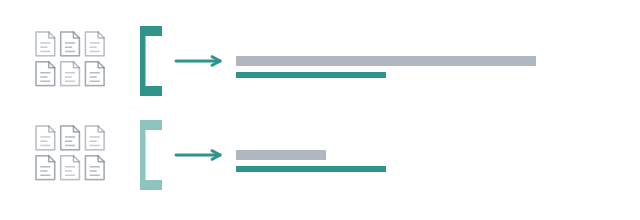

# Same work, two models



"Which model should the coder run on" gets asked a lot, and most answers are
benchmarks nobody ran on their own code. The honest version is small: the same
work, on the same repository, on two models, with the bills side by side.
This page does that twice, once from the prompt line in a minute and once
properly.

## The knob

Comparing models requires the model to be an **argument**. It is one of four
places a subagent's model can come from, and the nearest wins:

1. `--model` on `/run` or `/step`, or `model` on the `subagent` tool.
   Every subagent of that call, whatever its file says.
2. `model:` at the top of a flow file.
3. `model:` in the agent's frontmatter.
4. pi's own settings.

No environment variable is read anywhere: an ambient variable is exactly how a
run ends up on a model nobody named. Measured, in this repository: a `/run
explore` with no `--model` put all four subagents on a model named nowhere in
the tree, and nobody noticed until `usage.json` said so. An experiment that
left every level empty is measuring the operator, not the models.

None of the shipped agents or flows declares a `model:`, on purpose: a package
that pinned one would override your settings and fail outright for anyone
without a key for that provider. **A definition that ships leaves it open; a
measurement pins it.**

## The quick version

The two compared below are open-weight models served from the same endpoint:
`provider/model-a`, of 31B parameters, and `provider/model-b`, a 120B
mixture-of-experts model. Put two your pi can reach in their place: what this
page shows is the shape of the comparison, and the shape does not depend on
which two.

The same question, once per model:

```
/run --model <provider/model-a> explore how is the wall time of a subagent measured, and where is it shown
/run --model <provider/model-b> explore how is the wall time of a subagent measured, and where is it shown
```

Two folders under `runs/`, two `usage.json`, one table:

| | provider/model-a | provider/model-b |
| --- | --- | --- |
| wall | 77.8s | 41.2s |
| busy | 147.0s | 105.8s |
| parallelism | 1.89 | 2.57 |
| input | 191.0k | 710.2k |
| output | 8.3k | 9.0k |
| tool calls, three scouts | 9 / 6 / 4 | 25 / 24 / 28 |
| cost | not reported | not reported |

The larger model was twice as fast and spent almost four times the input
tokens: its scouts made three times the calls, each resending a growing
context. Both answers found `performance.now()` in `src/subagent.ts`. The
first gave no line numbers and said where its scouts disagreed, one saying a
finished subagent's wall time is not displayed on its own, another that the
expanded view shows it. The second
gave numbers with confidence, and two of three were wrong: it put the final
measurement at `src/subagent.ts:353-357`, and `detailLine` at
`src/reporters/tui.ts` lines 146 to 155, where the code has them at lines 387
and 176. Read the two synthesiser reports in the two folders and you know more
about these models on your code than a leaderboard can tell you.

One run each, though. The fast model may have been lucky, the slow one may have
hit a slow minute on a shared server. That is the limit of the quick version,
and it is why the proper one repeats.

## The proper version

`experiment` is a harness above a workflow: M models, N repetitions, one
directory per cell, one table. It returns no `Result` and composes with
nothing, deliberately, because a harness that could be nested inside a
workflow would be measuring itself.

```bash
node examples/12-experiment.ts <provider/model-a> <provider/model-b>
```

The example runs a coder and reviewer loop twice per model on this
repository, with the coder's tools cut down to read-only so that it describes
the change rather than making it, and prints the table:

```
| model | runs | ok | converged | iterations | usage | mean wall | mean $ |
| --- | --- | --- | --- | --- | --- | --- | --- |
| provider/model-a | 2 | 2/2 | 2/2 | 1×2 | 4 turns 496.7s ↑43k ↓21k $0.0000 | 248.4s | $0.0000 |
| provider/model-b | 2 | 2/2 | 1/2 | 2×1 3×1 | 10 turns 124.9s ↑201k ↓15k $0.0000 | 62.5s | $0.0000 |
```

The fast model of the quick version was fast again, four times over, and it
converged once in two: `2×1 3×1` is one run of two iterations and one that
reached the cap of three with no `LGTM`, which is why `ok` and `converged`
are two columns. The slow one converged in one iteration both times, and its
first coder took three minutes to describe a change to one file. Whether
either review was worth its price is in the transcripts under `runs/`, and is
the question you actually had.

Something else is in those transcripts. The larger model's reviewer, on its
first cell, called a tool with an empty name four times, a `search` tool that
does not exist once, and `grep` with no pattern twice. The smaller one's
reviewer called `verdict` three times over its two cells, a tool its definition names for when a
flow hands it one and which a plain loop does not. pi refused each call,
`Tool search not found`, `Tool verdict not found`, and the turn went on. That
is the [boundary from page five](05-an-agent-that-cannot-write.md) seen from
the other side: what a session holds is what can run, whatever the model
reaches for.

Its shape is short enough to copy:

```typescript
import { experiment, experimentTable, loop, saysWord } from "@ai-for-dev/combo";

const report = await experiment({
	models: ["provider/model-a", "provider/model-b"],
	repetitions: 2,
	timeoutMs: 300_000,
	run: async (cell) => {
		const result = await loop({
			...cell.options,
			steps: [coder, reviewer],
			input: task,
			lifetime: "workflow",
			until: (step) => saysWord(step.output, "LGTM"),
			maxIterations: 3,
		});
		return { ok: result.ok, converged: result.converged, iterations: result.iterations };
	},
});

console.log(experimentTable(report).join("\n"));
```

**Spreading `cell.options` is the contract.** It carries the cell's model and
its export directory, the experiment's signal, deadline and `cwd`, and a
listener that records every event. A callback that rebuilds those by hand puts
its subagents on the wrong model in the wrong directory, and measures nothing.
Whatever the callback returns becomes the table's columns, so `converged` and
`iterations` are there because this callback said so and for no other reason.

The rules it keeps, each one a way a comparison learns to lie:

- **Sequential by default.** Two cells racing for one machine measure the
  contention. Raise `concurrency` when the providers are remote and you know
  what you are trading.
- **Model-major order.** Every repetition of the first model, then the second,
  so an interrupted matrix holds finished models rather than a fragment of
  each.
- **A failed cell stays in the report, with its usage.** Dropping it would turn
  "two models out of three answered" into a clean comparison of the survivors.
  A callback that throws is a failed cell, not a crashed experiment.
- **Sums are stored, means are displayed.** `experiment.json` carries totals;
  the mean column is computed when the table is drawn and never written down.
  Averaging averages is how a study starts lying about itself.
- **Every cell keeps its event stream**, `events.jsonl`, with no way to turn
  that off: a cell whose stream was not kept can only be re-run, and a matrix
  is expensive.

```
runs/2026-09-23_22-27-04/
├── experiment.json
├── experiment.md
├── provider-model-a/
│   ├── rep-1/    usage.json  events.jsonl  coder-1.jsonl  reviewer-1.jsonl …
│   └── rep-2/
└── provider-model-b/
    └── …
```

A flow needs no special support: `runFlow(run, input, { ...cell.options,
runDir: cell.dir })` in the callback runs `explore` per cell, each cell its
own run directory, and the quick version above becomes the proper one in a
few lines.

Every subagent in these eleven pages was placed by you, through a call, a file
or a flag. The last page is about the one that places its own.

**Next:** [A subagent that splits its own task](12-a-subagent-with-subagents.md).
