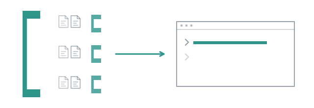

# A subagent that splits its own task



Everything so far had you, or a file, decide how the work was split. There is
a third case: an agent that looks at its task, decides it is too big, and
spawns help. Whether it can is not the question. How far down that goes, who
is allowed to do it, and what the bill looks like afterwards are.

## Who may delegate

Nothing in a call turns delegation on. The **agent's own definition** does:

```bash
cat agents/explorer.md
```

```markdown
---
name: explorer
description: Answers a question about a large codebase by splitting the reading across scouts
tools: read, grep, find, ls, subagent
lifetime: task
concurrency: 3
---

You answer one question about a codebase you have not read.

The repository is too large to read yourself, so you split the reading. …
Two to four tasks. Fewer than two and you may as well read it yourself; more
than four and you are guessing at where the answer is rather than thinking.
```

`subagent` in `tools:` is combo's, not pi's, and an agent that names it is
handed one. Anybody else is offered nothing. The roster it may reach is the
one your call loaded, so `scope` covers the grandchildren too; a name that is
not on it is refused, never guessed. `concurrency: 3` is how many children it
runs at once, and it belongs in the file because it follows from how the agent
was told to think: two to four tasks, three in flight.

## Run it, and keep the record

```
> use subagent with agent "explorer", model "<provider/model>" and export true to compare the reporters in src/reporters
```

The dots draw the tree as it grows:

```
● explorer#1  subagent agent=scout tasks=["Analyze `src/reporters/cons…
  provider/model · 75.2s
  ● scout#1  read src/reporters/console.ts
    provider/model · 13.9s
  ✓ scout#2  provider/model · ↑2.7k ↓313 · 7.9s
  ✓ scout#3  provider/model · ↑4.4k ↓1.1k · 7.0s
  ● scout#4  read src/reporters/herdr-probe.ts
    provider/model · 6.9s
esc stops everything · ctrl+↑↓ selects · ctrl+del stops the selected one
```

The explorer listed the directory, read its `index.ts`, `src/events.ts` and
`tui.ts`, wrote four tasks and handed them over. Three ran at once, and the
fourth started when the first of them ended. The explorer's own line has no
tokens after 75 seconds: it is still in its first turn, waiting on the call,
and pi's counters are read when a turn ends. The children sit under the one
that asked for them, indented, and the tool row keeps that shape when it is
over:

```
subagent single explorer [provider/model] [export]
  Compare the reporters in src/reporters
✓ explorer#1 Compare the reporters in src/reporters
    … 2 earlier calls
    read src/events.ts
    read src/reporters/tui.ts
    subagent agent=scout tasks=["Analyze `src/reporters/cons…
  ✓ scout#1 Analyze `src/reporters/console.ts`. What does the…
      read src/reporters/console.ts
  ✓ scout#2 Analyze `src/reporters/record.ts`. What does the …
      read src/reporters/record.ts
  ✓ scout#3 Analyze `src/reporters/picture.ts`. How does `cre…
      read src/reporters/picture.ts
  ✓ scout#4 Analyze `src/reporters/herdr.ts` and its related …
      … 1 earlier call
      read src/reporters/herdr.ts
      read src/reporters/herdr-client.ts
      read src/reporters/herdr-probe.ts

5 turns 134.5s ↑61k ↓6k  ×1.48
exported to /…/combo/runs/2026-09-24_00-45-00
```

Read the four tasks. Each scout sees only the line the explorer wrote it, and
each line names the files to start from and asks one question about them.
That is the explorer's prompt doing its job, and the first thing to check
when a delegating agent comes back with nonsense is whether the children were
asked badly. It is also where a gap shows: `silent.ts`, `tree.ts` and
`traffic.ts` went to nobody, and the explorer had read only `tui.ts` itself.

A failed child is a value the parent reads, not the end of its turn. An
earlier run of the same line lost one of its four scouts to the provider,
`Stream ended without finish_reason`. The explorer read the failure in the
tool's answer and called `subagent` a second time, with that one task, and a
fifth scout read the three herdr files the fourth never reached.

## The bill is a tree

`export true` wrote every transcript and one `usage.json` into
`runs/<timestamp>/`, and the report carries the tree:

| subagent | parent | wall | input | output | calls |
| --- | --- | --- | --- | --- | --- |
| explorer#1 | | 90.9s | 29.1k | 1.8k | 5 |
| scout#1 | explorer#1 | 14.6s | 2.9k | 733 | 1 |
| scout#2 | explorer#1 | 7.9s | 2.7k | 313 | 1 |
| scout#3 | explorer#1 | 7.0s | 4.4k | 1.1k | 1 |
| scout#4 | explorer#1 | 14.1s | 21.7k | 2.0k | 4 |
| **run** | | **91.0s** | **60.9k** | **6.0k** | parallelism 1.48 |

Two rules are visible in it. **The total is the tree, never the root.** The
explorer's own turn cost 29.1k input tokens; the run cost 60.9k, and a report
that summed the roots would call this a cheap agent when it is a cheap agent
and an expensive run. **The link is an id, never a name.** Two explorers
running at once share a name; `parentId` is the id `spawn` minted for whoever
asked, and a child whose parent is not in the list reads as a root rather
than vanishing from the sum.

## How deep it goes

Two levels by default: your session, a child, a grandchild. Pass `maxDepth`
on the call to change it. At the bound, the tool is **still handed over and
refuses when called**, saying how deep it is and how deep it may go. With
`maxDepth 1` on the same line, the tool row says `[≤1 deep]`, and the
explorer's own call came back:

```
You are 1 level(s) deep and 1 is the limit. Do this part of the work yourself.
```

It tried once more, with a single task for one file, got the same sentence,
and then did as told: it read ten of the files itself, one turn of 264.4
seconds and 113k input tokens, nearly twice the input of the tree above,
because every file it read was sent again with each call after it. Withholding the tool instead would leave a
model calling a tool that is not there, getting "unknown tool", and trying
again. That is the runaway turn [the meter](10-the-meter.md) exists to catch,
and a refusal in words is what a model can act on.

The children run on the terms of the call: its model, its deadline, its export
directory, its signal. `esc` stops the whole tree, `ctrl+↑↓` walks it children
included, and a delegated child is disposable whatever the parent's lifetime.
An agent a flow runs is handed the tool the same way when its `tools:` names
it, and its children's transcripts go in `<parent>.children/` beside its own.

## Where the line is

An agent can split its task. It cannot write a flow, and it will not be
given a way to: what a generated flow would buy is a reviewable artefact,
and `orchestrate` already gives that with a parser and a cap. A second, larger
place where a model decides the shape of a run is more surface for the same
benefit. You write the file; the file is data; the run is ours.

That is the last of the twelve. What they had in common was not a feature:
every claim an agent made had a record behind it you could open, and every
act it performed went through a boundary you could read in a file.
[Design decisions](../decisions.md) has the reasons, and the reversals.
